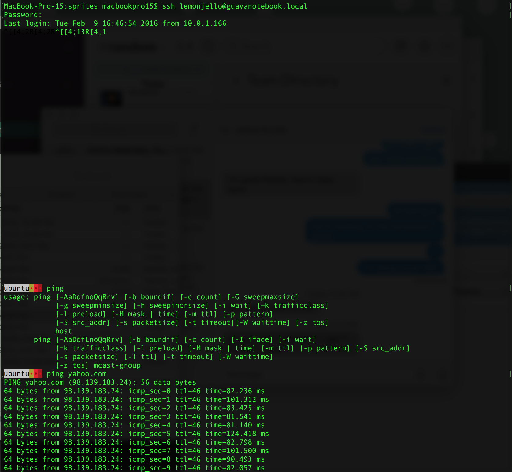

# Assignment 2
[sirseim]: https://twitter.com/sirseim "SirSeim's Twitter"
[joshkuroda]: https://twitter.com/joshkuroda "Josh Kuroda's Twitter"
#####[Edward Seim][sirseim] & [Joshua Kuroda][joshkuroda]

## Process Survey

**1.** 

output:
```
52 UserEventAgent
53 syslogd
56 kextd
57 fseventsd
63 configd
64 iStatMenusDaemo
65 powerd
70 airportd
72 warmd
73 mds
78 iconservicesage
79 diskarbitration
82 coreduetd
84 wdhelper
86 opendirectoryd
87 DDService64d
88 wirelessproxd
90 apsd
91 launchservicesd
93 securityd
98 blued
99 autofsd
104 kdc
109 revisiond
111 logind
112 KernelEventAgen
113 leapd
115 hidd
116 AirPlayXPCHelpe
117 notifyd
118 coreservicesd
119 amfid
120 taskgated
124 authd
127 aslmanager
128 cfprefsd
131 sandboxd
135 diagnosticd
156 com.apple.ctkpc
164 coresymbolicati
165 ctkd
167 secinitd
211 awdd
222 networkd_privil
223 com.apple.CodeS
225 awacsd
227 findmydeviced
236 lsd
240 ntpd
241 nehelper
244 usbd
245 com.apple.ifdre
246 VDCAssistant
256 akd
257 CVMServer
270 mds_stores
288 watchdogd
294 com.apple.Accou
296 securityd_servi
308 smd
313 WirelessRadioMa
333 deleted
334 TMCacheDelete
335 installd
338 CrashReporterSu
343 sharedfilelistd
347 systemsoundserv
348 tccd
371 writeconfig
380 filecoordinatio
486 com.apple.IASUt
514 racoon
516 suhelperd
539 mdflagwriter
684 spindump
685 SubmitDiagInfo
690 login
691 com.apple.audio
692 systemstatsd
832 com.apple.Perfo
877 dbfseventsd
878 dbfseventsd
1273 com.apple.Ambie
1368 sysmond
1828 com.apple.audio
2892 com.apple.cmio.
8952 diskmanagementd
9041 periodic-wrappe
9206 periodic-wrappe
9898 login
16407 syspolicyd
16411 nbstated
35858 periodic-wrappe
57121 aslmanager
67121 system_installd
89035 cupsd
89191 ocspd
90494 diskimages-help
90498 hdiejectd
91098 rpcsvchost
91159 ReportCrash
91165 auditd
```

command:
```
pgrep -u root -l
```

**2.**

output:
```
60 tvmobilisvcd
110 loginwindow
298 UserEventAgent
300 distnoted
301 universalaccess
302 cfprefsd
305 CommCenter
306 lsd
310 usernoted
312 nsurlsessiond
315 identityservice
316 secd
318 cloudphotosd
319 accountsd
321 callservicesd
322 imagent
323 tccd
324 IMDPersistenceA
325 akd
326 nsurlstoraged
327 com.apple.Addre
329 secinitd
332 useractivityd
336 fmfd
341 sharingd
342 CalendarAgent
344 CalNCService
345 CloudKeychainPr
351 ZoomWindowStart
355 EscrowSecurityA
363 com.apple.geod
365 sharedfilelistd
373 pbs
374 bird
375 swcd
376 pboard
378 fontd
385 cloudd
392 com.apple.Cloud
393 ContainerMetada
422 IDSKeychainSync
445 com.apple.sbd
446 com.apple.lakit
468 cdpd
469 followupd
472 ARDAgent
479 photolibraryd
485 com.apple.ICPPh
487 ScopedBookmarkA
488 com.apple.Addre
489 com.apple.photo
499 com.apple.Photo
504 AssetCacheLocat
507 com.apple.photo
508 com.apple.Photo
509 com.apple.photo
511 com.apple.photo
518 suggestd
529 mdflagwriter
531 mapspushd
532 SocialPushAgent
533 gamed
534 SafariCloudHist
535 CallHistorySync
537 askpermissiond
540 storeaccountd
554 com.apple.spotl
567 mdworker
650 Safari
653 Dock
655 SystemUIServer
656 Finder
660 pkd
662 storeassetd
665 FinderExtension
666 FinderSyncExt
668 iconservicesage
670 com.apple.dock.
671 soagent
672 CallHistoryPlug
673 storeuid
674 Spotlight
675 com.apple.Comme
676 WiFiProxy
677 com.apple.Comme
679 storedownloadd
680 SpotlightNetHel
681 com.apple.appst
686 com.apple.WebKi
687 com.apple.WebKi
693 bash
706 com.apple.speec
707 com.apple.WebKi
708 com.apple.WebKi
709 com.apple.WebKi
710 com.apple.WebKi
711 com.apple.WebKi
712 com.apple.WebKi
718 com.apple.audio
719 com.apple.audio
720 com.apple.Safar
721 com.apple.BKAge
722 SafariNotificat
724 com.apple.audio
725 com.apple.WebKi
726 com.apple.audio
727 com.apple.Safar
731 FolderActionsDi
732 spindump_agent
734 tvmobiliqlhandl
737 Keychain Circle
740 iStatServerAgen
741 iStat Menus Not
742 NotificationCen
745 RzDeviceEngine
746 icdd
747 iStatMenusAgent
748 AppleIDAuthAgen
750 Day One Reminde
754 SpotifyWebHelpe
755 AirPlayUIAgent
756 cloudpaird
759 iStat Menus Sta
760 WiFiAgent
761 diagnostics_age
764 RzUpdater
779 CheatSheet
780 Bartender 2
781 com.apple.audio
782 com.apple.audio
783 iTunesHelper
784 Flux
785 Growl
786 FruitJuice
787 gfxCardStatus
788 Dropbox
792 VMware Fusion H
793 iTeleport Conne
794 TransmitMenu
795 Box Sync
796 MusicManagerHel
797 Caffeine
798 BitTorrent Sync
805 com.apple.notif
806 com.apple.Weath
811 AppleSpell
814 com.apple.Input
815 IMRemoteURLConn
846 VMware Fusion S
868 Box Sync Monito
871 storelegacy
874 LaterAgent
879 dbfseventsd
930 garcon
1265 DiskUnmountWatc
1305 ViewBridgeAuxil
1336 loginitemregist
1676 USBAgent
1677 2BUA8C4S2C.com.
1772 rtcreportingd
1827 com.apple.hiser
1961 BezelUIServer
2495 DataDetectorsDy
2496 com.apple.Safar
2596 rcd
2608 CMFSyncAgent
2693 recentsd
2695 com.apple.tonel
2888 Messages
2893 com.apple.audio
2894 com.apple.audio
2895 com.apple.Chara
3559 com.apple.Safar
8305 com.apple.WebKi
9899 bash
10664 com.apple.Safar
16410 nbagent
17083 com.apple.WebKi
19386 navd
24749 Sublime Text 2
26377 com.apple.Comme
30718 Day One Reminde
30793 printtool
30876 com.apple.WebKi
34365 com.apple.WebKi
34373 com.apple.audio
34374 com.apple.audio
60022 CoreServicesUIA
75791 Image Capture E
78892 imklaunchagent
78894 com.apple.Speec
81949 ipcserver
82526 mdworker
82537 com.apple.WebKi
84230 mdworker
86054 mdworker
86255 mdworker
86372 Tweetbot
86932 Slack
86936 com.apple.audio
86937 com.apple.audio
87955 com.apple.CoreS
87977 com.apple.WebKi
88172 com.apple.WebKi
88774 com.apple.WebKi
89247 com.apple.iClou
89695 com.apple.WebKi
90043 com.apple.WebKi
90530 SafariPlugInUpd
90731 mdworker
90749 com.apple.WebKi
91107 eapolclient
91121 mdworker
91122 mdworker
91123 mdworker
91124 mdworker
91375 com.apple.WebKi
91378 syncdefaultsd
```

command:
```
pgrep -u macbookpro15 -l
```

**3.**

Application using the most real memory:
```
kernal_task
```

Application using the most virtual memory:
```
Safari
```

command:
```
top -o mem
top -o virt
```

**4.**

output:
```
daemon
eseim
jkuroda
message+
mysql
ntop
ntp
postfix
root
sshd
syslog
www-data
```

command:
```
ps aux | awk '{ print $1 }' | sed '1 d' | sort | uniq
```

## I/O and File "Gymnastics"

**1.**


**2.**



command:
```
ssh lemonjello@guavanotebook.local
```

**3.**

Most populous sub-directory of ~/
```
~/Pictures
```

command for first-level sub-directory size sorting:
```
du -d 1 | sort -n
```

command for matching to regex:
```
du -h | grep 'regex'
```

**4.**


**5.**

command for listing mounted volumes:
```
ls -alG /Volumes
```

output:
```
total 8
drwxrwxrwt@  4 root          admin    136 Feb  9 20:19 .
drwxr-xr-x  33 root          wheel   1190 Feb  3 07:30 ..
drwxr-xr-x   1 macbookpro15  staff  24576 Apr 13  2015 BOOTCAMP
lrwxr-xr-x   1 root          admin      1 Feb  3 07:27 MacBook Pro 15 512 GB -> /
```

## CSI: OS

Pre-OS software


Kernal Extensions:
```
total 0
drwxr-xr-x  286 root  wheel  9724 Feb  9 10:31 .
drwxr-xr-x   79 root  wheel  2686 Feb  9 20:19 ..
drwxr-xr-x@   3 root  wheel   102 Aug 26 17:06 ALF.kext
drwxr-xr-x@   3 root  wheel   102 Sep 16 18:21 AMD2400Controller.kext
drwxr-xr-x@   3 root  wheel   102 Sep 16 18:21 AMD2600Controller.kext
drwxr-xr-x@   3 root  wheel   102 Sep 16 18:21 AMD3800Controller.kext
drwxr-xr-x@   3 root  wheel   102 Sep 16 18:21 AMD4600Controller.kext
drwxr-xr-x@   3 root  wheel   102 Sep 16 18:21 AMD4800Controller.kext
drwxr-xr-x@   3 root  wheel   102 Sep 16 18:21 AMD5000Controller.kext
drwxr-xr-x@   3 root  wheel   102 Sep 16 18:21 AMD6000Controller.kext
drwxr-xr-x@   3 root  wheel   102 Sep 16 18:21 AMD7000Controller.kext
drwxr-xr-x@   3 root  wheel   102 Sep 16 18:21 AMD8000Controller.kext
drwxr-xr-x@   3 root  wheel   102 Sep 16 18:21 AMD9000Controller.kext
drwxr-xr-x@   3 root  wheel   102 Sep 16 18:21 AMDFramebuffer.kext
drwxr-xr-x@   3 root  wheel   102 Sep 16 18:21 AMDMTLBronzeDriver.bundle
drwxr-xr-x@   3 root  wheel   102 Sep 16 18:21 AMDRadeonVADriver.bundle
drwxr-xr-x@   3 root  wheel   102 Sep 16 18:21 AMDRadeonX3000.kext
drwxr-xr-x@   3 root  wheel   102 Sep 16 18:21 AMDRadeonX3000GLDriver.bundle
drwxr-xr-x@   3 root  wheel   102 Sep 16 18:21 AMDRadeonX4000.kext
drwxr-xr-x@   3 root  wheel   102 Sep 16 18:21 AMDRadeonX4000GLDriver.bundle
drwxr-xr-x@   3 root  wheel   102 Sep 16 18:21 AMDShared.bundle
drwxr-xr-x@   3 root  wheel   102 Sep 16 18:21 AMDSupport.kext
drwxr-xr-x@   3 root  wheel   102 Sep 16 17:40 ATIRadeonX2000.kext
drwxr-xr-x@   3 root  wheel   102 Sep 16 17:39 ATIRadeonX2000GA.plugin
drwxr-xr-x@   3 root  wheel   102 Sep 16 17:40 ATIRadeonX2000GLDriver.bundle
drwxr-xr-x@   3 root  wheel   102 Sep 16 17:40 ATIRadeonX2000VADriver.bundle
drwxr-xr-x    3 root  wheel   102 Jan 12  2014 ATTOiSCSI.kext
drwxr-xr-x    3 root  wheel   102 Oct 16  2013 AVFrameBuffer.kext
drwxr-xr-x    3 root  wheel   102 Oct 16  2013 AVVideoCard.kext
drwxr-xr-x@   3 root  wheel   102 Sep 16 17:25 Apple16X50Serial.kext
drwxr-xr-x@   3 root  wheel   102 Sep 16 17:35 AppleACPIPlatform.kext
drwxr-xr-x@   3 root  wheel   102 Sep 16 17:29 AppleAHCIPort.kext
drwxr-xr-x@   3 root  wheel   102 Aug 26 17:05 AppleAPIC.kext
drwxr-xr-x@   3 root  wheel   102 Sep 16 17:26 AppleBMC.kext
drwxr-xr-x@   3 root  wheel   102 Sep 16 17:33 AppleBacklight.kext
drwxr-xr-x@   6 root  wheel   204 Feb  3 07:25 AppleBacklightExpert.kext
drwxr-xr-x@   3 root  wheel   102 Sep 16 18:27 AppleBluetoothMultitouch.kext
drwxr-xr-x@   3 root  wheel   102 Aug 26 17:10 AppleBluetoothRemote.kext
drwxr-xr-x@   3 root  wheel   102 Sep 16 18:04 AppleCameraInterface.kext
drwxr-xr-x@   3 root  wheel   102 Aug 26 17:04 AppleCredentialManager.kext
drwxr-xr-x@   3 root  wheel   102 Aug 26 17:03 AppleEFIRuntime.kext
drwxr-xr-x@   3 root  wheel   102 Aug 26 17:04 AppleFDEKeyStore.kext
drwxr-xr-x@   3 root  wheel   102 Aug 26 17:04 AppleFIVRDriver.kext
drwxr-xr-x@   3 root  wheel   102 Aug 26 17:03 AppleFSCompressionTypeDataless.kext
drwxr-xr-x@   3 root  wheel   102 Aug 26 17:03 AppleFSCompressionTypeZlib.kext
drwxr-xr-x@   3 root  wheel   102 Aug 22 16:28 AppleFWAudio.kext
drwxr-xr-x@   3 root  wheel   102 Aug 26 17:09 AppleFileSystemDriver.kext
drwxr-xr-x@   3 root  wheel   102 Sep 16 18:03 AppleGraphicsControl.kext
drwxr-xr-x@   3 root  wheel   102 Sep 16 18:27 AppleGraphicsPowerManagement.kext
drwxr-xr-x@   3 root  wheel   102 Sep 16 18:11 AppleHDA.kext
drwxr-xr-x@   3 root  wheel   102 Sep 16 18:27 AppleHIDKeyboard.kext
drwxr-xr-x@   3 root  wheel   102 Sep 16 18:27 AppleHIDMouse.kext
drwxr-xr-x@   3 root  wheel   102 Jun 28  2015 AppleHIDTransport.kext
drwxr-xr-x@   3 root  wheel   102 Aug 26 17:07 AppleHPET.kext
drwxr-xr-x@   3 root  wheel   102 Sep 16 17:28 AppleHPM.kext
drwxr-xr-x@   3 root  wheel   102 Sep 16 17:28 AppleHSSPIHIDDriver.kext
drwxr-xr-x@   3 root  wheel   102 Sep 16 17:28 AppleHSSPISupport.kext
drwxr-xr-x@   3 root  wheel   102 Aug 26 17:05 AppleHV.kext
drwxr-xr-x@   3 root  wheel   102 Aug 26 17:03 AppleHWSensor.kext
drwxr-xr-x@   3 root  wheel   102 Sep 16 18:14 AppleIRController.kext
drwxr-xr-x@   3 root  wheel   102 Jun 28  2015 AppleInputDeviceSupport.kext
drwxr-xr-x@   3 root  wheel   102 Sep 16 18:22 AppleIntelBDWGraphics.kext
drwxr-xr-x@   3 root  wheel   102 Sep 16 18:22 AppleIntelBDWGraphicsFramebuffer.kext
drwxr-xr-x@   3 root  wheel   102 Sep 16 18:22 AppleIntelBDWGraphicsGLDriver.bundle
drwxr-xr-x@   3 root  wheel   102 Sep 16 18:20 AppleIntelBDWGraphicsMTLDriver.bundle
drwxr-xr-x@   3 root  wheel   102 Sep 16 18:22 AppleIntelBDWGraphicsVADriver.bundle
drwxr-xr-x@   3 root  wheel   102 Sep 16 18:22 AppleIntelBDWGraphicsVAME.bundle
drwxr-xr-x@   3 root  wheel   102 Aug 26 17:03 AppleIntelCPUPowerManagement.kext
drwxr-xr-x@   3 root  wheel   102 Aug 26 17:04 AppleIntelCPUPowerManagementClient.kext
drwxr-xr-x@   3 root  wheel   102 Sep 16 18:22 AppleIntelFramebufferAzul.kext
drwxr-xr-x@   3 root  wheel   102 Sep 16 18:22 AppleIntelFramebufferCapri.kext
drwxr-xr-x@   3 root  wheel   102 Sep 16 18:20 AppleIntelGraphicsShared.bundle
drwxr-xr-x@   3 root  wheel   102 Sep 16 17:40 AppleIntelHD3000Graphics.kext
drwxr-xr-x@   3 root  wheel   102 Sep 16 17:39 AppleIntelHD3000GraphicsGA.plugin
drwxr-xr-x@   3 root  wheel   102 Sep 16 17:40 AppleIntelHD3000GraphicsGLDriver.bundle
drwxr-xr-x@   3 root  wheel   102 Sep 16 17:40 AppleIntelHD3000GraphicsVADriver.bundle
drwxr-xr-x@   3 root  wheel   102 Sep 16 18:22 AppleIntelHD4000Graphics.kext
drwxr-xr-x@   3 root  wheel   102 Sep 16 18:22 AppleIntelHD4000GraphicsGLDriver.bundle
drwxr-xr-x@   3 root  wheel   102 Sep 16 18:20 AppleIntelHD4000GraphicsMTLDriver.bundle
drwxr-xr-x@   3 root  wheel   102 Sep 16 18:22 AppleIntelHD4000GraphicsVADriver.bundle
drwxr-xr-x@   3 root  wheel   102 Sep 16 18:22 AppleIntelHD5000Graphics.kext
drwxr-xr-x@   3 root  wheel   102 Sep 16 18:22 AppleIntelHD5000GraphicsGLDriver.bundle
drwxr-xr-x@   3 root  wheel   102 Sep 16 18:20 AppleIntelHD5000GraphicsMTLDriver.bundle
drwxr-xr-x@   3 root  wheel   102 Sep 16 18:22 AppleIntelHD5000GraphicsVADriver.bundle
drwxr-xr-x@   3 root  wheel   102 Sep 16 17:40 AppleIntelHDGraphics.kext
drwxr-xr-x@   3 root  wheel   102 Sep 16 17:40 AppleIntelHDGraphicsFB.kext
drwxr-xr-x@   3 root  wheel   102 Sep 16 17:39 AppleIntelHDGraphicsGA.plugin
drwxr-xr-x@   3 root  wheel   102 Sep 16 17:40 AppleIntelHDGraphicsGLDriver.bundle
drwxr-xr-x@   3 root  wheel   102 Sep 16 17:40 AppleIntelHDGraphicsVADriver.bundle
drwxr-xr-x@   3 root  wheel   102 Sep 16 18:22 AppleIntelHSWVA.bundle
drwxr-xr-x@   3 root  wheel   102 Sep 16 18:22 AppleIntelIVBVA.bundle
drwxr-xr-x@   3 root  wheel   102 Sep 16 17:25 AppleIntelLpssDmac.kext
drwxr-xr-x@   3 root  wheel   102 Sep 16 17:25 AppleIntelLpssGspi.kext
drwxr-xr-x@   3 root  wheel   102 Sep 16 17:25 AppleIntelLpssI2C.kext
drwxr-xr-x@   3 root  wheel   102 Sep 16 17:25 AppleIntelLpssI2CController.kext
drwxr-xr-x@   3 root  wheel   102 Sep 16 17:25 AppleIntelLpssSpiController.kext
drwxr-xr-x@   3 root  wheel   102 Sep 16 17:25 AppleIntelLpssUART.kext
drwxr-xr-x@   3 root  wheel   102 Aug 26 17:05 AppleIntelMCEReporter.kext
drwxr-xr-x@   3 root  wheel   102 Sep 16 18:26 AppleIntelPCHPMC.kext
drwxr-xr-x@   3 root  wheel   102 Oct 13 18:40 AppleIntelSKLGraphics.kext
drwxr-xr-x@   3 root  wheel   102 Oct 13 18:40 AppleIntelSKLGraphicsFramebuffer.kext
drwxr-xr-x@   3 root  wheel   102 Oct 13 18:40 AppleIntelSKLGraphicsGLDriver.bundle
drwxr-xr-x@   3 root  wheel   102 Oct 13 18:38 AppleIntelSKLGraphicsMTLDriver.bundle
drwxr-xr-x@   3 root  wheel   102 Oct 13 18:40 AppleIntelSKLGraphicsVADriver.bundle
drwxr-xr-x@   3 root  wheel   102 Oct 13 18:40 AppleIntelSKLGraphicsVAME.bundle
drwxr-xr-x@   3 root  wheel   102 Sep 16 17:40 AppleIntelSNBGraphicsFB.kext
drwxr-xr-x@   3 root  wheel   102 Sep 16 17:40 AppleIntelSNBVA.bundle
drwxr-xr-x@   3 root  wheel   102 Aug 26 17:04 AppleIntelSlowAdaptiveClocking.kext
drwxr-xr-x@   3 root  wheel   102 Nov 12 10:45 AppleKextExcludeList.kext
drwxr-xr-x@   3 root  wheel   102 Aug 26 17:05 AppleKeyStore.kext
drwxr-xr-x@   3 root  wheel   102 Aug 26 17:08 AppleKeyswitch.kext
drwxr-xr-x@   3 root  wheel   102 Sep 16 18:27 AppleLPC.kext
drwxr-xr-x@   3 root  wheel   102 Sep 16 17:29 AppleLSIFusionMPT.kext
drwxr-xr-x@   3 root  wheel   102 Sep 16 18:11 AppleMCCSControl.kext
drwxr-xr-x@   3 root  wheel   102 Sep 16 17:29 AppleMCP89RootPortPM.kext
drwxr-xr-x@   3 root  wheel   102 Aug 22 16:24 AppleMIDIBluetoothDriver.plugin
drwxr-xr-x@   3 root  wheel   102 Aug 22 16:26 AppleMIDIFWDriver.plugin
drwxr-xr-x@   3 root  wheel   102 Aug 22 16:23 AppleMIDIIACDriver.plugin
drwxr-xr-x@   3 root  wheel   102 Aug 22 16:24 AppleMIDIRTPDriver.plugin
drwxr-xr-x@   3 root  wheel   102 Aug 22 16:23 AppleMIDIUSBDriver.plugin
drwxr-xr-x@   3 root  wheel   102 Aug 26 17:05 AppleMatch.kext
drwxr-xr-x@   3 root  wheel   102 Aug 26 17:06 AppleMikeyHIDDriver.kext
drwxr-xr-x    3 root  wheel   102 Sep 12  2014 AppleMobileDevice.kext
drwxr-xr-x@   3 root  wheel   102 Aug 26 17:05 AppleMobileFileIntegrity.kext
drwxr-xr-x@   3 root  wheel   102 Sep 16 18:03 AppleMultitouchDriver.kext
drwxr-xr-x@   3 root  wheel   102 Sep 16 18:14 AppleOSXUSBNCM.kext
drwxr-xr-x@   3 root  wheel   102 Sep 16 17:25 AppleOSXWatchdog.kext
drwxr-xr-x@   3 root  wheel   102 Aug 26 17:03 ApplePlatformEnabler.kext
drwxr-xr-x@   3 root  wheel   102 Aug 26 17:07 AppleRAID.kext
drwxr-xr-x@   3 root  wheel   102 Sep 16 17:31 AppleRAIDCard.kext
drwxr-xr-x@   3 root  wheel   102 Aug 26 17:07 AppleRTC.kext
drwxr-xr-x@   3 root  wheel   102 Sep 16 17:26 AppleSDXC.kext
drwxr-xr-x@   3 root  wheel   102 Aug 26 19:12 AppleSEP.kext
drwxr-xr-x@   3 root  wheel   102 Aug 26 17:08 AppleSMBIOS.kext
drwxr-xr-x@   3 root  wheel   102 Sep 16 17:26 AppleSMBusController.kext
drwxr-xr-x@   3 root  wheel   102 Sep 16 17:26 AppleSMBusPCI.kext
drwxr-xr-x@   3 root  wheel   102 Aug 26 17:07 AppleSMC.kext
drwxr-xr-x@   3 root  wheel   102 Sep 16 17:34 AppleSMCLMU.kext
drwxr-xr-x@   3 root  wheel   102 Aug 26 17:05 AppleSRP.kext
drwxr-xr-x@   3 root  wheel   102 Aug 26 17:09 AppleSmartBatteryManager.kext
drwxr-xr-x@   3 root  wheel   102 Sep 16 18:21 AppleStorageDrivers.kext
drwxr-xr-x@   3 root  wheel   102 Aug 26 17:07 AppleThunderboltDPAdapters.kext
drwxr-xr-x@   3 root  wheel   102 Aug 26 17:08 AppleThunderboltEDMService.kext
drwxr-xr-x@   3 root  wheel   102 Sep 16 17:26 AppleThunderboltIP.kext
drwxr-xr-x@   3 root  wheel   102 Sep 16 17:26 AppleThunderboltNHI.kext
drwxr-xr-x@   3 root  wheel   102 Sep 16 17:25 AppleThunderboltPCIAdapters.kext
drwxr-xr-x@   3 root  wheel   102 Aug 26 19:12 AppleThunderboltUTDM.kext
drwxr-xr-x@   3 root  wheel   102 Sep 16 18:31 AppleTopCase.kext
drwxr-xr-x@   3 root  wheel   102 Sep 16 18:26 AppleTyMCEDriver.kext
drwxr-xr-x@   3 root  wheel   102 Sep 16 18:15 AppleUSBACM.kext
drwxr-xr-x@   3 root  wheel   102 Sep 16 18:08 AppleUSBAudio.kext
drwxr-xr-x@   3 root  wheel   102 Sep 16 18:15 AppleUSBCDC.kext
drwxr-xr-x@   3 root  wheel   102 Sep 16 18:15 AppleUSBDMM.kext
drwxr-xr-x@   3 root  wheel   102 Sep 16 18:15 AppleUSBDisplays.kext
drwxr-xr-x@   3 root  wheel   102 Sep 16 18:15 AppleUSBECM.kext
drwxr-xr-x@   3 root  wheel   102 Sep 16 18:15 AppleUSBEEM.kext
drwxr-xr-x@   3 root  wheel   102 Sep 16 18:16 AppleUSBEthernet.kext
drwxr-xr-x@   3 root  wheel   102 Sep 16 18:07 AppleUSBEthernetHost.kext
drwxr-xr-x@   3 root  wheel   102 Sep 16 18:08 AppleUSBFTDI.kext
drwxr-xr-x@   3 root  wheel   102 Sep 16 18:14 AppleUSBMultitouch.kext
drwxr-xr-x@   3 root  wheel   102 Sep 16 18:15 AppleUSBNCM.kext
drwxr-xr-x@   3 root  wheel   102 Sep 16 18:16 AppleUSBNetworking.kext
drwxr-xr-x@   3 root  wheel   102 Sep 16 18:15 AppleUSBTopCase.kext
drwxr-xr-x@   3 root  wheel   102 Sep 16 18:15 AppleUSBWCM.kext
drwxr-xr-x@   3 root  wheel   102 Sep 16 17:29 AppleUpstreamUserClient.kext
drwxr-xr-x@   3 root  wheel   102 Aug 28 19:37 AppleVADriver.bundle
drwxr-xr-x@   3 root  wheel   102 Sep 16 18:16 AppleWWANAutoEject.kext
drwxr-xr-x@   3 root  wheel   102 Aug 26 17:11 AppleXsanScheme.kext
drwxr-xr-x@   3 root  wheel   102 Sep 16 17:29 Apple_iSight.kext
drwxr-xr-x@   6 root  wheel   204 Feb  3 07:25 AudioAUUC.kext
drwxr-xr-x    3 root  wheel   102 May 23  2012 BJUSBLoad.kext
drwxr-xr-x@   3 root  wheel   102 Aug 26 17:03 BootCache.kext
drwxr-xr-x    3 root  wheel   102 Sep  5  2013 CUDA.kext
drwxr-xr-x@   3 root  wheel   102 Sep 16 18:07 CellPhoneHelper.kext
drwxr-xr-x@   3 root  wheel   102 Aug 26 17:05 CoreCaptureResponder.kext
drwxr-xr-x@   3 root  wheel   102 Aug 26 17:09 CoreStorage.kext
drwxr-xr-x@   3 root  wheel   102 Aug 26 17:04 DSACL.ppp
drwxr-xr-x@   3 root  wheel   102 Aug 26 17:04 DSAuth.ppp
drwxr-xr-x@   3 root  wheel   102 Aug 22 18:48 DVFamily.bundle
drwxr-xr-x@   3 root  wheel   102 Aug 26 17:11 Dont Steal Mac OS X.kext
drwxr-xr-x    3 root  wheel   102 May 10  2013 DroboTBT.kext
drwxr-xr-x@   3 root  wheel   102 Aug 26 17:04 EAP-KRB.ppp
drwxr-xr-x@   3 root  wheel   102 Aug 22 16:12 EAP-RSA.ppp
drwxr-xr-x@   3 root  wheel   102 Aug 26 17:04 EAP-TLS.ppp
drwxr-xr-x@   3 root  wheel   102 Sep 16 18:24 GeForce.kext
drwxr-xr-x@   3 root  wheel   102 Sep 16 18:24 GeForceAIRPlugin.bundle
drwxr-xr-x@   3 root  wheel   102 Sep 16 17:39 GeForceGA.plugin
drwxr-xr-x@   3 root  wheel   102 Sep 16 18:24 GeForceGLDriver.bundle
drwxr-xr-x@   3 root  wheel   102 Sep 16 18:24 GeForceMTLDriver.bundle
drwxr-xr-x@   3 root  wheel   102 Sep 16 17:40 GeForceTesla.kext
drwxr-xr-x@   3 root  wheel   102 Sep 16 17:40 GeForceTeslaGLDriver.bundle
drwxr-xr-x@   3 root  wheel   102 Sep 16 17:40 GeForceTeslaVADriver.bundle
drwxr-xr-x@   3 root  wheel   102 Sep 16 18:24 GeForceVADriver.bundle
drwxr-xr-x@   3 root  wheel   102 Sep 16 17:25 IO80211Family.kext
drwxr-xr-x@   3 root  wheel   102 Aug 26 17:05 IOACPIFamily.kext
drwxr-xr-x@   3 root  wheel   102 Aug 26 17:11 IOAHCIFamily.kext
drwxr-xr-x@   3 root  wheel   102 Sep 16 17:29 IOATAFamily.kext
drwxr-xr-x@   3 root  wheel   102 Aug 26 19:12 IOAVBFamily.kext
drwxr-xr-x@   3 root  wheel   102 Aug 26 19:12 IOAccelerator2D.plugin
drwxr-xr-x@   3 root  wheel   102 Sep 16 17:33 IOAcceleratorFamily.kext
drwxr-xr-x@   3 root  wheel   102 Sep 16 17:33 IOAcceleratorFamily2.kext
drwxr-xr-x@   3 root  wheel   102 Aug 26 17:10 IOAudioFamily.kext
drwxr-xr-x@   3 root  wheel   102 Aug 26 17:10 IOBDStorageFamily.kext
drwxr-xr-x@   3 root  wheel   102 Sep 16 18:18 IOBluetoothFamily.kext
drwxr-xr-x@   3 root  wheel   102 Sep 16 18:18 IOBluetoothHIDDriver.kext
drwxr-xr-x@   3 root  wheel   102 Aug 26 17:11 IOCDStorageFamily.kext
drwxr-xr-x@   3 root  wheel   102 Aug 26 17:09 IODVDStorageFamily.kext
drwxr-xr-x@   3 root  wheel   102 Aug 22 16:01 IOFireWireAVC.kext
drwxr-xr-x@   3 root  wheel   102 Sep 16 17:25 IOFireWireFamily.kext
drwxr-xr-x@   3 root  wheel   102 Aug 26 17:07 IOFireWireIP.kext
drwxr-xr-x@   3 root  wheel   102 Aug 22 16:03 IOFireWireSBP2.kext
drwxr-xr-x@   3 root  wheel   102 Aug 26 19:12 IOFireWireSerialBusProtocolTransport.kext
drwxr-xr-x@   6 root  wheel   204 Feb  3 07:25 IOGraphicsFamily.kext
drwxr-xr-x@   3 root  wheel   102 Aug 26 17:09 IOHDIXController.kext
drwxr-xr-x@   3 root  wheel   102 Aug 26 17:05 IOHIDFamily.kext
drwxr-xr-x@   6 root  wheel   204 Feb  3 07:25 IONDRVSupport.kext
drwxr-xr-x@   3 root  wheel   102 Sep 16 17:26 IONVMeFamily.kext
drwxr-xr-x@   3 root  wheel   102 Sep 16 17:25 IONetworkingFamily.kext
drwxr-xr-x@   6 root  wheel   204 Feb  3 07:25 IOPCIFamily.kext
drwxr-xr-x@   3 root  wheel   102 Sep 16 18:20 IOPlatformPluginFamily.kext
drwxr-xr-x@   3 root  wheel   102 Aug 26 17:04 IOReportFamily.kext
drwxr-xr-x@   3 root  wheel   102 Aug 26 19:11 IOSCSIArchitectureModelFamily.kext
drwxr-xr-x@   3 root  wheel   102 Aug 26 19:12 IOSCSIParallelFamily.kext
drwxr-xr-x@   3 root  wheel   102 Aug 26 17:05 IOSMBusFamily.kext
drwxr-xr-x@   3 root  wheel   102 Sep 16 18:14 IOSerialFamily.kext
drwxr-xr-x@   3 root  wheel   102 Aug 26 17:03 IOSlowAdaptiveClockingFamily.kext
drwxr-xr-x@   3 root  wheel   102 Aug 26 17:08 IOStorageFamily.kext
drwxr-xr-x@   3 root  wheel   102 Aug 26 17:03 IOStreamFamily.kext
drwxr-xr-x@   3 root  wheel   102 Aug 26 19:10 IOSurface.kext
drwxr-xr-x@   3 root  wheel   102 Aug 22 16:03 IOThunderboltFamily.kext
drwxr-xr-x@   3 root  wheel   102 Aug 26 19:12 IOTimeSyncFamily.kext
drwxr-xr-x@   3 root  wheel   102 Sep 16 18:15 IOUSBAttachedSCSI.kext
drwxr-xr-x@   3 root  wheel   102 Sep 16 18:14 IOUSBFamily.kext
drwxr-xr-x@   3 root  wheel   102 Sep 16 18:03 IOUSBHostFamily.kext
drwxr-xr-x@   3 root  wheel   102 Sep 16 18:12 IOUSBMassStorageClass.kext
drwxr-xr-x@   3 root  wheel   102 Sep 16 18:07 IOUSBMassStorageDriver.kext
drwxr-xr-x@   3 root  wheel   102 Aug 26 17:07 IOUserEthernet.kext
drwxr-xr-x@   3 root  wheel   102 Aug 26 17:33 IOVideoFamily.kext
drwxr-xr-x    3 root  wheel   102 May 22  2012 JMicronATA.kext
drwxr-xr-x@   3 root  wheel   102 Aug 26 17:04 L2TP.ppp
drwxr-xr-x@   3 root  wheel   102 Aug 26 17:08 Libm.kext
drwxr-xr-x@   3 root  wheel   102 Sep 16 18:24 NVDAGF100Hal.kext
drwxr-xr-x@   3 root  wheel   102 Sep 16 18:24 NVDAGK100Hal.kext
drwxr-xr-x@   3 root  wheel   102 Sep 16 17:40 NVDANV50HalTesla.kext
drwxr-xr-x@   3 root  wheel   102 Sep 16 18:24 NVDAResman.kext
drwxr-xr-x@   3 root  wheel   102 Sep 16 17:40 NVDAResmanTesla.kext
drwxr-xr-x@   3 root  wheel   102 Sep 16 18:24 NVDAStartup.kext
drwxr-xr-x@   3 root  wheel   102 Aug 22 16:01 NVMeSMARTLib.plugin
drwxr-xr-x@   3 root  wheel   102 Sep 16 17:25 NVSMU.kext
drwxr-xr-x@   3 root  wheel   102 Aug 26 17:08 OSvKernDSPLib.kext
drwxr-xr-x@   3 root  wheel   102 Aug 26 17:04 PPP.kext
drwxr-xr-x@   3 root  wheel   102 Aug 22 16:03 PPPSerial.ppp
drwxr-xr-x@   3 root  wheel   102 Aug 26 17:04 PPPoE.ppp
drwxr-xr-x@   3 root  wheel   102 Aug 26 17:04 PPTP.ppp
drwxr-xr-x@   3 root  wheel   102 Aug 26 17:15 Quarantine.kext
drwxr-xr-x@   3 root  wheel   102 Aug 26 17:04 Radius.ppp
drwxr-xr-x@   3 root  wheel   102 Mar 26  2015 RemoteVirtualInterface.kext
drwxr-xr-x@   3 root  wheel   102 Aug 22 16:11 SMARTLib.plugin
drwxr-xr-x@   3 root  wheel   102 Aug 26 17:09 SMCMotionSensor.kext
drwxr-xr-x@   3 root  wheel   102 Aug 26 17:10 Sandbox.kext
drwxr-xr-x    3 root  wheel   102 Aug  6  2012 Soundflower.kext
drwxr-xr-x@   6 root  wheel   204 Feb  3 07:25 System.kext
drwxr-xr-x@   3 root  wheel   102 Aug 26 17:03 TMSafetyNet.kext
drwxr-xr-x    3 root  wheel   102 May 10  2013 TrustedDataSCSIDriver.kext
drwxr-xr-x@   3 root  wheel   102 Aug 26 19:17 acfs.kext
drwxr-xr-x@   3 root  wheel   102 Aug 26 19:17 acfsctl.kext
drwxr-xr-x@   3 root  wheel   102 Aug 26 17:09 autofs.kext
drwxr-xr-x@   3 root  wheel   102 Aug 26 17:09 cd9660.kext
drwxr-xr-x@   3 root  wheel   102 Aug 26 17:14 cddafs.kext
drwxr-xr-x@   3 root  wheel   102 Aug 26 17:05 corecapture.kext
drwxr-xr-x@   3 root  wheel   102 Aug 26 17:04 corecrypto.kext
drwxr-xr-x@   3 root  wheel   102 Aug 26 17:03 exfat.kext
drwxr-xr-x    3 root  wheel   102 Aug 14  2013 hp_Deskjet_io_enabler.kext
drwxr-xr-x    3 root  wheel   102 Aug 14  2013 hp_fax_io.kext
drwxr-xr-x@   3 root  wheel   102 Aug 26 19:13 iPodDriver.kext
drwxr-xr-x@   3 root  wheel   102 Aug 26 17:09 mcxalr.kext
drwxr-xr-x@   3 root  wheel   102 Aug 26 17:09 msdosfs.kext
drwxr-xr-x@   3 root  wheel   102 Aug 26 17:05 ntfs.kext
drwxr-xr-x@   3 root  wheel   102 Aug 26 17:09 pmtelemetry.kext
drwxr-xr-x@   3 root  wheel   102 Aug 26 17:09 pthread.kext
drwxr-xr-x@   3 root  wheel   102 Aug 26 17:08 smbfs.kext
drwxr-xr-x@   3 root  wheel   102 Aug 26 17:09 triggers.kext
drwxr-xr-x@   3 root  wheel   102 Aug 26 17:05 udf.kext
drwxr-xr-x@   3 root  wheel   102 Aug 26 17:09 vecLib.kext
drwxr-xr-x@   3 root  wheel   102 Aug 27 18:15 webcontentfilter.kext
drwxr-xr-x@   3 root  wheel   102 Aug 26 17:03 webdav_fs.kext
```

Startup Items:
```
total 0
drwxr-xr-x   3 root  wheel   102 Oct 12 08:50 .
drwxr-xr-x  79 root  wheel  2686 Feb  9 20:19 ..
drwxr-xr-x   4 root  wheel   136 May 22  2013 CUDA
```

First process identification command:
```
ps aux | sort -n -k 2
```

The first launched process is launchd
```
USER              PID  %CPU %MEM      VSZ    RSS   TT  STAT STARTED      TIME COMMAND
root                1   0.0  0.1  2539712  13216   ??  Ss    3Feb16   9:17.69 /sbin/launchd
root               52   0.0  0.1  2554916  12228   ??  Ss    3Feb16   2:56.33 /usr/libexec/UserEventAgent (System)
root               53   0.0  0.0  2519088   1884   ??  Ss    3Feb16   3:33.68 /usr/sbin/syslogd
root               56   0.0  0.1  2563452  12804   ??  Ss    3Feb16   0:40.10 /usr/libexec/kextd
root               57   0.0  0.0  2782488   3356   ??  Ss    3Feb16   1:20.03 /System/Library/Frameworks/CoreServices.framework/Versions/A/Frameworks/FSEvents.framework/Versions/A/Support/fseventsd
macbookpro15       60   0.0  0.0  2526728   3640   ??  Ss    3Feb16   3:36.25 /Applications/TVMOBiLi.app/Contents/MacOS/tvmobilisvcd /run
_appleevents       62   0.0  0.0  2546260   2816   ??  Us    3Feb16   0:02.15 /System/Library/CoreServices/appleeventsd --server
root               63   0.0  0.0  2577980   8312   ??  Ss    3Feb16   5:34.55 /usr/libexec/configd
root               64   0.0  0.0  2550532   6428   ??  Ss    3Feb16   5:59.07 /Library/Application Support/iStat Menus 5/iStatMenusDaemon
root               65   0.0  0.0  2541732   2688   ??  Ss    3Feb16   2:54.06 /System/Library/CoreServices/powerd.bundle/powerd
root               70   0.0  0.1  2565128  15676   ??  Ss    3Feb16   3:49.30 /usr/libexec/airportd
root               72   0.0  0.0  2549600   2480   ??  SNs   3Feb16   0:01.59 /usr/libexec/warmd
root               73   0.0  0.2  2784036  26604   ??  Ss    3Feb16  12:22.16 /System/Library/Frameworks/CoreServices.framework/Frameworks/Metadata.framework/Support/mds
_conveyor          77   0.0  0.0  2518496   1220   ??  Ss    3Feb16   0:00.26 /System/Library/CoreServices/iconservicesd
root               78   0.0  0.0  2570644    612   ??  Ss    3Feb16   0:00.27 /System/Library/CoreServices/iconservicesagent
root               79   0.0  0.0  2541616   2296   ??  Ss    3Feb16   0:27.55 /usr/libexec/diskarbitrationd
root               82   0.0  0.1  2552512   9144   ??  Ss    3Feb16   0:47.00 /usr/libexec/coreduetd
root               84   0.0  0.0  2518404      8   ??  Ss    3Feb16   0:00.04 /usr/libexec/wdhelper
root               86   0.0  0.1  2568560   9484   ??  Ss    3Feb16   2:24.63 /usr/libexec/opendirectoryd
root               87   0.0  0.0  2551656   1656   ??  Ss    3Feb16   3:28.14 /Library/Application Support/Data Robotics/Drobo Dashboard/DDService64d
root               88   0.0  0.0  2519632   3256   ??  Ss    3Feb16   1:11.27 /usr/sbin/wirelessproxd
root               90   0.0  0.0  2546872   7044   ??  Ss    3Feb16   0:58.74 /System/Library/PrivateFrameworks/ApplePushService.framework/apsd
root               91   0.0  0.0  2547664   7112   ??  Ss    3Feb16   1:52.62 /System/Library/CoreServices/launchservicesd
_usbmuxd           92   0.0  0.0  2518556   1064   ??  Ss    3Feb16   0:22.50 /System/Library/PrivateFrameworks/MobileDevice.framework/Versions/A/Resources/usbmuxd -launchd
root               93   0.0  0.0  2545744   5336   ??  Ss    3Feb16   2:53.53 /usr/sbin/securityd -i
_locationd         95   0.0  0.1  2556596   9984   ??  Ss    3Feb16   1:18.79 /usr/libexec/locationd
root               98   0.0  0.0  2545204   6140   ??  Ss    3Feb16   4:15.95 /usr/sbin/blued
root               99   0.0  0.0  2516536    396   ??  Ss    3Feb16   0:00.09 autofsd
root              104   0.0  0.0  2544616    992   ??  Ss    3Feb16   0:00.29 /System/Library/PrivateFrameworks/Heimdal.framework/Helpers/kdc
_mdnsresponder    107   0.0  0.0  2546984   5320   ??  Ss    3Feb16   1:13.47 /usr/sbin/mDNSResponder
root              109   0.0  0.0  2556148   1044   ??  Ss    3Feb16   0:01.61 /System/Library/PrivateFrameworks/GenerationalStorage.framework/Versions/A/Support/revisiond
macbookpro15      110   0.0  0.2  2651392  26012   ??  Ss    3Feb16   1:38.07 /System/Library/CoreServices/loginwindow.app/Contents/MacOS/loginwindow console
root              111   0.0  0.0  2516052    928   ??  Ss    3Feb16   0:00.25 /System/Library/CoreServices/logind
root              112   0.0  0.0  2491792      8   ??  Ss    3Feb16   0:00.03 /usr/sbin/KernelEventAgent
root              113   0.0  0.0  2573584   3636   ??  Ss+   3Feb16   1:10.16 /Applications/Leap Motion.app/Contents/MacOS/leapd
root              115   0.0  0.0  2517764   2868   ??  Ss    3Feb16  11:35.12 /usr/libexec/hidd
root              116   0.0  0.0  2545324   1820   ??  Ss    3Feb16   0:04.07 /usr/libexec/AirPlayXPCHelper
root              117   0.0  0.0  2516940   2200   ??  Ss    3Feb16   4:02.72 /usr/sbin/notifyd
root              118   0.0  0.0  2550848   3396   ??  Ss    3Feb16   0:05.38 /System/Library/CoreServices/coreservicesd
root              119   0.0  0.0  2545112   3240   ??  Ss    3Feb16   0:04.70 /usr/libexec/amfid
root              120   0.0  0.0  2544368   2872   ??  Ss    3Feb16   0:02.65 /usr/libexec/taskgated -s
_distnote         123   0.0  0.0  2515864   1356   ??  Ss    3Feb16   0:31.88 /usr/sbin/distnoted daemon
root              124   0.0  0.0  2546260   4232   ??  Ss    3Feb16   2:45.45 /System/Library/Frameworks/Security.framework/Versions/A/XPCServices/authd.xpc/Contents/MacOS/authd
root              127   0.0  0.0  2516584   3372   ??  Ss    3Feb16   0:09.50 aslmanager
root              128   0.0  0.0  2517796   6300   ??  Ss    3Feb16   4:03.44 /usr/sbin/cfprefsd daemon
root              131   0.0  0.1  2562072  11868   ??  Ss    3Feb16   0:03.79 /usr/libexec/sandboxd
root              135   0.0  0.0  2543716   3180   ??  Ss    3Feb16   0:44.53 /usr/libexec/diagnosticd
root              156   0.0  0.0  2516576    396   ??  Ss    3Feb16   0:00.08 /System/Library/Frameworks/PCSC.framework/Versions/A/XPCServices/com.apple.ctkpcscd.xpc/Contents/MacOS/com.apple.ctkpcscd
root              164   0.0  0.0  2520092   1028   ??  Ss    3Feb16   2:12.46 /System/Library/PrivateFrameworks/CoreSymbolication.framework/coresymbolicationd
root              165   0.0  0.0  2516560    476   ??  Ss    3Feb16   0:00.08 /System/Library/Frameworks/CryptoTokenKit.framework/ctkd -s
root              167   0.0  0.0  2544260    600   ??  Ss    3Feb16   0:00.25 /usr/libexec/secinitd
root              211   0.0  0.0  2543800   2308   ??  Ss    3Feb16   0:04.52 /System/Library/PrivateFrameworks/WirelessDiagnostics.framework/Support/awdd
_coreaudiod       212   0.0  0.0  2545904   5356   ??  Ss    3Feb16   9:53.03 /usr/sbin/coreaudiod
_coreaudiod       219   0.0  0.0  2542088    548   ??  Ss    3Feb16   0:00.16 /System/Library/Frameworks/CoreAudio.framework/Versions/A/XPCServices/com.apple.audio.DriverHelper.xpc/Contents/MacOS/com.apple.audio.DriverHelper
_networkd         220   0.0  0.0  2516600   4312   ??  Ss    3Feb16   0:55.32 /usr/libexec/networkd
root              222   0.0  0.0  2516556    640   ??  Ss    3Feb16   0:00.27 /usr/libexec/networkd_privileged
root              223   0.0  0.0  2518308   1532   ??  Ss    3Feb16   0:00.76 /System/Library/Frameworks/Security.framework/Versions/A/XPCServices/com.apple.CodeSigningHelper.xpc/Contents/MacOS/com.apple.CodeSigningHelper
root              225   0.0  0.0  2547520   3780   ??  Ss    3Feb16   0:03.70 /usr/libexec/awacsd
root              227   0.0  0.0  2549704   2752   ??  Ss    3Feb16   0:03.48 /usr/libexec/findmydeviced
_windowserver     234   1.0  0.8  8335124 132016   ??  Ss    3Feb16 104:37.03 /System/Library/Frameworks/ApplicationServices.framework/Frameworks/CoreGraphics.framework/Resources/WindowServer -daemon
root              236   0.0  0.0  2555280   1564   ??  Ss    3Feb16   0:11.59 /usr/libexec/lsd runAsRoot
_nsurlsessiond    238   0.0  0.0  2548616   2176   ??  Ss    3Feb16   0:03.22 /usr/libexec/nsurlsessiond --privileged
root              240   0.0  0.0  2519244    888   ??  Ss    3Feb16   0:06.98 /usr/sbin/ntpd -c /private/etc/ntp-restrict.conf -n -g -p /var/run/ntpd.pid -f /var/db/ntp.drift
root              241   0.0  0.0  2547180   2224   ??  Ss    3Feb16   0:02.60 /usr/libexec/nehelper
root              244   0.0  0.0  2543812   1364   ??  Ss    3Feb16   0:30.22 /usr/libexec/usbd
root              245   0.0  0.0  2507864    520   ??  Ss    3Feb16   0:00.48 /System/Library/CryptoTokenKit/com.apple.ifdreader.slotd/Contents/MacOS/com.apple.ifdreader
root              246   0.0  0.0  2550724   1808   ??  Ss    3Feb16   0:23.35 /System/Library/Frameworks/CoreMediaIO.framework/Resources/VDC.plugin/Contents/Resources/VDCAssistant
_networkd         249   0.0  0.0  2552580   5396   ??  Ss    3Feb16   1:37.83 /usr/libexec/symptomsd
root              256   0.0  0.0  2543152   1912   ??  Ss    3Feb16   0:02.01 /System/Library/PrivateFrameworks/AuthKit.framework/Versions/A/Support/akd
root              257   0.0  0.0  2568460    888   ??  Ss    3Feb16   0:00.92 /System/Library/Frameworks/OpenGL.framework/Versions/A/Libraries/CVMServer
root              270   0.0  1.4  3655772 234300   ??  Ss    3Feb16   7:30.91 /System/Library/Frameworks/CoreServices.framework/Frameworks/Metadata.framework/Versions/A/Support/mds_stores
root              288   0.0  0.0  2516872    356   ??  Ss    3Feb16   0:01.41 /usr/libexec/watchdogd
root              294   0.0  0.0  2516580    968   ??  Ss    3Feb16   0:00.20 /System/Library/PrivateFrameworks/AccountPolicy.framework/XPCServices/com.apple.AccountPolicyHelper.xpc/Contents/MacOS/com.apple.AccountPolicyHelper
root              296   0.0  0.0  2544272   3012   ??  Ss    3Feb16   2:45.98 /usr/libexec/securityd_service
macbookpro15      298   0.0  0.0  2549376   5560   ??  S     3Feb16   0:38.47 /usr/libexec/UserEventAgent (Aqua)
macbookpro15      300   0.0  0.0  2515864   5320   ??  S     3Feb16   1:41.80 /usr/sbin/distnoted agent
macbookpro15      301   0.0  0.0  2566696   6380   ??  S     3Feb16   0:11.19 /usr/sbin/universalaccessd launchd -s
macbookpro15      302   0.0  0.0  2532820   7636   ??  S     3Feb16   1:21.30 /usr/sbin/cfprefsd agent
macbookpro15      305   0.0  0.1  2587976  12152   ??  S     3Feb16   0:14.83 /System/Library/Frameworks/CoreTelephony.framework/Support/CommCenter
macbookpro15      306   0.0  0.1  2554128  10684   ??  S     3Feb16   0:14.74 /usr/libexec/lsd
root              308   0.0  0.0  2517092    792   ??  Us    3Feb16   0:00.10 /usr/libexec/smd
macbookpro15      310   0.0  0.0  2549544   5940   ??  S     3Feb16   0:15.77 /usr/sbin/usernoted
macbookpro15      312   0.0  0.1  2553944   8492   ??  S     3Feb16   3:06.10 /usr/libexec/nsurlsessiond
root              313   0.0  0.0  2542864   2048   ??  Ss    3Feb16   0:02.90 /usr/sbin/WirelessRadioManagerd
macbookpro15      315   0.0  0.1  2559296  10620   ??  S     3Feb16   0:38.52 /System/Library/PrivateFrameworks/IDS.framework/identityservicesd.app/Contents/MacOS/identityservicesd
macbookpro15      316   0.0  0.0  2544348   4076   ??  S     3Feb16   0:21.04 /usr/libexec/secd
macbookpro15      318   0.0  0.0  2606884   6740   ??  S     3Feb16   1:36.05 /System/Library/CoreServices/cloudphotosd.app/Contents/MacOS/cloudphotosd
macbookpro15      319   0.0  0.1  2578728  10376   ??  S     3Feb16   5:14.16 /System/Library/Frameworks/Accounts.framework/Versions/A/Support/accountsd
_conveyor         320   0.0  0.0  2599316    664   ??  Ss    3Feb16   0:01.02 /Library/MakerBot/conveyor-svc --config_file /Library/MakerBot/conveyor.conf
macbookpro15      321   0.0  0.1  2592592  12172   ??  S     3Feb16   0:19.09 /System/Library/PrivateFrameworks/TelephonyUtilities.framework/callservicesd
macbookpro15      322   0.0  0.1  2552572   9172   ??  S     3Feb16   0:28.20 /System/Library/PrivateFrameworks/IMCore.framework/imagent.app/Contents/MacOS/imagent
macbookpro15      323   0.0  0.0  2552140   5228   ??  U     3Feb16   0:34.75 /System/Library/PrivateFrameworks/TCC.framework/Resources/tccd
macbookpro15      324   0.0  0.1  2590684  16952   ??  S     3Feb16   1:26.50 /System/Library/PrivateFrameworks/IMDPersistence.framework/XPCServices/IMDPersistenceAgent.xpc/Contents/MacOS/IMDPersistenceAgent
macbookpro15      325   0.0  0.0  2548424   7040   ??  S     3Feb16   0:23.20 /System/Library/PrivateFrameworks/AuthKit.framework/Versions/A/Support/akd
macbookpro15      326   0.0  0.1  2559140  13140   ??  U     3Feb16   1:25.35 /usr/libexec/nsurlstoraged
macbookpro15      327   0.0  0.0  2541740   3164   ??  S     3Feb16   0:09.15 /System/Library/Frameworks/AddressBook.framework/Versions/A/XPCServices/com.apple.AddressBook.ContactsAccountsService.xpc/Contents/MacOS/com.apple.AddressBook.ContactsAccountsService
macbookpro15      329   0.0  0.0  2547124   4760   ??  S     3Feb16   0:12.40 /usr/libexec/secinitd
macbookpro15      332   0.0  0.0  2549616   3992   ??  S     3Feb16   6:28.16 /System/Library/PrivateFrameworks/UserActivity.framework/Agents/useractivityd
root              333   0.0  0.0  2520484   3044   ??  Ss    3Feb16   0:36.79 /System/Library/PrivateFrameworks/CacheDelete.framework/deleted
root              334   0.0  0.0  2542520   1676   ??  Ss    3Feb16   0:02.11 /System/Library/CoreServices/backupd.bundle/Contents/Resources/TMCacheDelete
root              335   0.0  0.0  2573884   2508   ??  Ss    3Feb16   0:10.32 /System/Library/PrivateFrameworks/PackageKit.framework/Resources/installd
macbookpro15      336   0.0  0.0  2546240   2940   ??  S     3Feb16   0:04.75 /usr/libexec/fmfd
root              338   0.0  0.0  2516028   1480   ??  Ss    3Feb16   0:00.24 /System/Library/CoreServices/CrashReporterSupportHelper server-init
macbookpro15      341   0.0  0.1  2560228  11172   ??  S     3Feb16   0:34.95 /usr/libexec/sharingd
macbookpro15      342   0.0  0.2  2570288  31768   ??  S     3Feb16   6:17.62 /System/Library/PrivateFrameworks/CalendarAgent.framework/Executables/CalendarAgent
root              343   0.0  0.0  2516424    804   ??  Ss    3Feb16   0:00.52 /System/Library/CoreServices/sharedfilelistd --enable-legacy-services
macbookpro15      344   0.0  0.2  2569652  26764   ??  Ss    3Feb16   2:26.06 /System/Library/PrivateFrameworks/CalendarAgent.framework/Versions/A/XPCServices/CalNCService.xpc/Contents/MacOS/CalNCService
macbookpro15      345   0.0  0.0  2517324   5972   ??  S     3Feb16   0:01.89 /System/Library/Frameworks/Security.framework/Versions/A/Resources/CloudKeychainProxy.bundle/Contents/MacOS/CloudKeychainProxy
root              347   0.0  0.0  2551432   3420   ??  Ss    3Feb16   0:05.85 /usr/sbin/systemsoundserverd
root              348   0.0  0.0  2546096    764   ??  Ss    3Feb16   0:00.44 /System/Library/PrivateFrameworks/TCC.framework/Resources/tccd system
macbookpro15      351   0.0  0.0  2553088   3572   ??  SN    3Feb16   0:48.34 /System/Library/CoreServices/ZoomWindow.app/Contents/MacOS/ZoomWindowStarter launchd -s
macbookpro15      355   0.0  0.0  2569328   2620   ??  S     3Feb16   0:01.93 /System/Library/CoreServices/EscrowSecurityAlert.app/Contents/MacOS/EscrowSecurityAlert
macbookpro15      363   0.0  0.1  2548916   9116   ??  S     3Feb16   0:34.23 /System/Library/PrivateFrameworks/GeoServices.framework/Versions/A/XPCServices/com.apple.geod.xpc/Contents/MacOS/com.apple.geod
macbookpro15      365   0.0  0.0  2544864   4228   ??  S     3Feb16   0:03.36 /System/Library/CoreServices/sharedfilelistd
root              371   0.0  0.0  2517052    444   ??  Ss    3Feb16   0:00.09 /System/Library/PrivateFrameworks/SystemAdministration.framework/XPCServices/writeconfig.xpc/Contents/MacOS/writeconfig
macbookpro15      373   0.0  0.0  2547816   1104   ??  S     3Feb16   0:00.60 /System/Library/CoreServices/pbs
macbookpro15      374   0.0  0.1  2554524  16108   ??  S     3Feb16   0:32.25 /System/Library/PrivateFrameworks/CloudDocsDaemon.framework/Versions/A/Support/bird
macbookpro15      375   0.0  0.0  2547536   3352   ??  S     3Feb16   0:01.96 /usr/libexec/swcd
macbookpro15      376   0.0  0.0  2467564     32   ??  S     3Feb16   0:00.03 /usr/sbin/pboard
macbookpro15      378   0.0  0.1  2578208  10444   ??  S     3Feb16   0:54.75 /System/Library/Frameworks/ApplicationServices.framework/Frameworks/ATS.framework/Support/fontd
root              380   0.0  0.0  2522352   1936   ??  Us    3Feb16   0:01.68 /usr/sbin/filecoordinationd
macbookpro15      385   0.0  0.1  2568968  20512   ??  S     3Feb16   2:43.34 /System/Library/PrivateFrameworks/CloudKitDaemon.framework/Support/cloudd
macbookpro15      392   0.0  0.0  2550196   2416   ??  S     3Feb16   0:01.00 /System/Library/PrivateFrameworks/CloudPhotoServices.framework/Versions/A/Frameworks/CloudPhotosConfigurationXPC.framework/Versions/A/XPCServices/com.apple.CloudPhotosConfiguration.xpc/Contents/MacOS/com.apple.CloudPhotosConfiguration
macbookpro15      393   0.0  0.0  2549036   4336   ??  Ss    3Feb16   0:01.81 /System/Library/PrivateFrameworks/CloudDocsDaemon.framework/XPCServices/ContainerMetadataExtractor.xpc/Contents/MacOS/ContainerMetadataExtractor
_mbsetupuser      403   0.0  0.0  2516380   1436   ??  S     3Feb16   0:05.86 /usr/sbin/cfprefsd agent
macbookpro15      422   0.0  0.0  2516196   1272   ??  S     3Feb16   0:00.33 /System/Library/Frameworks/Security.framework/Versions/A/Resources/IDSKeychainSyncingProxy.bundle/Contents/MacOS/IDSKeychainSyncingProxy
_mbsetupuser      425   0.0  0.0  2515864   1224   ??  S     3Feb16   0:07.59 /usr/sbin/distnoted agent
_mbsetupuser      434   0.0  0.0  2543452    576   ??  S     3Feb16   0:00.14 /usr/libexec/secd
_mbsetupuser      438   0.0  0.0  2545544    692   ??  S     3Feb16   0:01.47 /usr/libexec/secinitd
_mbsetupuser      439   0.0  0.0  2549724    616   ??  S     3Feb16   0:00.32 /System/Library/PrivateFrameworks/TCC.framework/Resources/tccd
_mbsetupuser      442   0.0  0.0  2542472   1072   ??  S     3Feb16   0:00.30 /System/Library/PrivateFrameworks/IMDPersistence.framework/XPCServices/IMDPersistenceAgent.xpc/Contents/MacOS/IMDPersistenceAgent
_mbsetupuser      443   0.0  0.0  2541740    700   ??  S     3Feb16   0:00.25 /System/Library/Frameworks/AddressBook.framework/Versions/A/XPCServices/com.apple.AddressBook.ContactsAccountsService.xpc/Contents/MacOS/com.apple.AddressBook.ContactsAccountsService
macbookpro15      445   0.0  0.0  2542500   4272   ??  S     3Feb16   0:02.17 /System/Library/PrivateFrameworks/CloudServices.framework/Versions/A/XPCServices/com.apple.sbd.xpc/Contents/MacOS/com.apple.sbd
macbookpro15      446   0.0  0.0  2545320   2176   ??  S     3Feb16   0:03.62 /System/Library/PrivateFrameworks/CloudServices.framework/Versions/A/Frameworks/EscrowService.framework/Versions/A/XPCServices/com.apple.lakitu.xpc/Contents/MacOS/com.apple.lakitu
macbookpro15      468   0.0  0.0  2542116   2072   ??  S     3Feb16   0:00.49 /System/Library/PrivateFrameworks/CoreCDP.framework/Versions/A/Resources/cdpd
macbookpro15      469   0.0  0.0  2522824   1132   ??  S     3Feb16   0:00.13 /System/Library/PrivateFrameworks/CoreFollowUp.framework/Versions/A/Support/followupd
macbookpro15      472   0.0  0.0  2549488   1224   ??  S     3Feb16   0:03.81 /System/Library/CoreServices/RemoteManagement/ARDAgent.app/Contents/MacOS/ARDAgent
macbookpro15      479   0.0  0.0  2580796   2648   ??  S     3Feb16   5:51.15 /System/Library/PrivateFrameworks/PhotoLibraryPrivate.framework/Versions/A/Support/photolibraryd
macbookpro15      485   0.0  0.0  2553624    712   ??  Ss    3Feb16   0:00.49 /System/Library/CoreServices/cloudphotosd.app/Contents/XPCServices/com.apple.ICPPhotoStreamLibraryService.xpc/Contents/MacOS/com.apple.ICPPhotoStreamLibraryService
root              486   0.0  0.0  2516024    496   ??  Ss    3Feb16   0:00.09 /System/Library/PrivateFrameworks/IASUtilities.framework/Versions/A/XPCServices/com.apple.IASUtilities.IASCloudConfigHelper.xpc/Contents/MacOS/com.apple.IASUtilities.IASCloudConfigHelper
macbookpro15      487   0.0  0.0  2578940    468   ??  S     3Feb16   0:02.16 /System/Library/CoreServices/ScopedBookmarkAgent
macbookpro15      488   0.0  0.0  2542220    680   ??  Ss    3Feb16   0:00.21 /System/Library/Frameworks/AddressBook.framework/Versions/A/XPCServices/com.apple.AddressBook.InternetAccountsBridge.xpc/Contents/MacOS/com.apple.AddressBook.InternetAccountsBridge
macbookpro15      489   0.0  0.0  2584860   3432   ??  Ss    3Feb16   2:49.83 /System/Library/PrivateFrameworks/PhotoLibraryPrivate.framework/Versions/A/Frameworks/PhotoLibraryServices.framework/Versions/A/XPCServices/com.apple.photomoments.xpc/Contents/MacOS/com.apple.photomoments
macbookpro15      499   0.0  0.0  2550728    548   ??  Ss    3Feb16   0:00.18 /System/Library/PrivateFrameworks/PhotoLibrary.framework/Versions/A/XPCServices/com.apple.PhotoIngestService.xpc/Contents/MacOS/com.apple.PhotoIngestService
macbookpro15      504   0.0  0.0  2545396   2160   ??  S     3Feb16   0:04.01 /System/Library/PrivateFrameworks/AssetCacheServices.framework/XPCServices/AssetCacheLocatorService.xpc/Contents/MacOS/AssetCacheLocatorService -a
_mbsetupuser      505   0.0  0.0  2516192   1064   ??  S     3Feb16   0:00.47 /System/Library/Frameworks/Security.framework/Versions/A/Resources/CloudKeychainProxy.bundle/Contents/MacOS/CloudKeychainProxy
macbookpro15      507   0.0  0.0  2573032    736   ??  Ss    3Feb16   0:33.84 /System/Library/PrivateFrameworks/PhotoLibraryPrivate.framework/Versions/A/Frameworks/MediaConversionService.framework/Versions/A/XPCServices/com.apple.photos.ImageConversionService.xpc/Contents/MacOS/com.apple.photos.ImageConversionService
macbookpro15      508   0.0  0.0  2558892   1856   ??  Ss    3Feb16   0:08.00 /System/Library/PrivateFrameworks/PhotoLibrary.framework/Versions/A/XPCServices/com.apple.PhotoIngestService.xpc/Contents/MacOS/com.apple.PhotoIngestService
macbookpro15      509   0.0  0.0  2567212   1564   ??  Ss    3Feb16   0:37.56 /System/Library/PrivateFrameworks/PhotoLibraryPrivate.framework/Versions/A/Frameworks/PhotoLibraryServices.framework/Versions/A/XPCServices/com.apple.photomodel.xpc/Contents/MacOS/com.apple.photomodel
macbookpro15      511   0.0  0.0  2551824    724   ??  Ss    3Feb16   0:04.95 /System/Library/PrivateFrameworks/PhotoLibraryPrivate.framework/Versions/A/Frameworks/MediaConversionService.framework/Versions/A/XPCServices/com.apple.photos.ImageConversionService.xpc/Contents/MacOS/com.apple.photos.ImageConversionService
root              514   0.0  0.0  2519444   1096   ??  Ss    3Feb16   0:03.07 /usr/sbin/racoon -D
_softwareupdate   515   0.0  0.0  4122384   3064   ??  Ss    3Feb16   3:18.46 /System/Library/CoreServices/Software Update.app/Contents/Resources/softwareupdated
root              516   0.0  0.0  2549308    988   ??  Ss    3Feb16   0:01.07 /System/Library/PrivateFrameworks/SoftwareUpdate.framework/Resources/suhelperd
macbookpro15      518   0.0  0.1  2589996  16412   ??  S     3Feb16   0:23.33 /System/Library/PrivateFrameworks/CoreSuggestions.framework/Versions/A/Support/suggestd
macbookpro15      529   0.0  0.0  2518308    352   ??  S     3Feb16   0:02.47 /System/Library/Frameworks/CoreServices.framework/Frameworks/Metadata.framework/Versions/A/Support/mdflagwriter
macbookpro15      531   0.0  0.0  2544244   2688   ??  S     3Feb16   0:03.81 /System/Library/CoreServices/mapspushd
macbookpro15      532   0.0  0.0  2544856   3444   ??  S     3Feb16   0:03.34 /System/Library/CoreServices/SocialPushAgent.app/Contents/MacOS/SocialPushAgent
macbookpro15      533   0.0  0.0  2558884   6976   ??  S     3Feb16   0:17.73 /System/Library/PrivateFrameworks/GameCenterFoundation.framework/Versions/A/gamed
macbookpro15      534   0.0  0.0  2542216   1224   ??  S     3Feb16   0:31.61 /usr/libexec/SafariCloudHistoryPushAgent
macbookpro15      535   0.0  0.0  2546460   4144   ??  S     3Feb16   0:01.43 /System/Library/PrivateFrameworks/CallHistory.framework/Support/CallHistorySyncHelper
macbookpro15      537   0.0  0.0  2541828   1000   ??  S     3Feb16   0:00.44 /System/Library/PrivateFrameworks/AskPermission.framework/Versions/A/Resources/askpermissiond
root              539   0.0  0.0  2510116    212   ??  S     3Feb16   0:00.04 /System/Library/Frameworks/CoreServices.framework/Frameworks/Metadata.framework/Versions/A/Support/mdflagwriter
macbookpro15      540   0.0  0.0  2553892   3268   ??  S     3Feb16   0:08.76 /System/Library/PrivateFrameworks/CommerceKit.framework/Versions/A/Resources/storeaccountd
_spotlight        545   0.0  0.0  2515864    768   ??  S     3Feb16   0:04.27 /usr/sbin/distnoted agent
_spotlight        546   0.0  0.0  2553632    756   ??  S     3Feb16   1:42.03 /System/Library/Frameworks/CoreServices.framework/Frameworks/Metadata.framework/Versions/A/Support/mdworker -s mdworker-sizing -c MDSSizingWorker -m com.apple.mdworker.sizing
macbookpro15      554   0.0  0.0  2549648   3020   ??  S     3Feb16   0:05.07 /System/Library/PrivateFrameworks/CoreSpotlight.framework/Support/com.apple.spotlight.IndexAgent
macbookpro15      567   0.0  0.0  2550976    916   ??  S     3Feb16   0:17.45 /System/Library/Frameworks/CoreServices.framework/Frameworks/Metadata.framework/Versions/A/Support/mdworker -s mdworker-sizing -c MDSSizingWorker -m com.apple.mdworker.sizing
macbookpro15      650   0.0  1.3  4691012 226304   ??  S     3Feb16  16:51.05 /Applications/Safari.app/Contents/MacOS/Safari -psn_0_155686
macbookpro15      652   0.6  0.9  2886012 145844   ??  R     3Feb16   7:20.49 /Applications/Utilities/Terminal.app/Contents/MacOS/Terminal -psn_0_163880
macbookpro15      653   0.0  0.3  2885124  53748   ??  S     3Feb16   1:43.72 /System/Library/CoreServices/Dock.app/Contents/MacOS/Dock
macbookpro15      655   0.0  0.2  2630644  27444   ??  S     3Feb16   4:05.33 /System/Library/CoreServices/SystemUIServer.app/Contents/MacOS/SystemUIServer
macbookpro15      656   0.0  1.0  2919672 175668   ??  S     3Feb16   1:44.97 /System/Library/CoreServices/Finder.app/Contents/MacOS/Finder
macbookpro15      660   0.0  0.0  2548512   7328   ??  S     3Feb16   0:40.18 /usr/libexec/pkd
macbookpro15      662   0.0  0.1  2561612  10252   ??  S     3Feb16   0:46.16 /System/Library/PrivateFrameworks/CommerceKit.framework/Versions/A/Resources/storeassetd
macbookpro15      665   0.0  0.0  2571356   2772   ??  Ss    3Feb16   0:03.91 /Applications/BitTorrent Sync.app/Contents/PlugIns/FinderExtension.appex/Contents/MacOS/FinderExtension
macbookpro15      666   0.0  0.0  2578968   3080   ??  Ss    3Feb16   0:01.87 /Applications/Box Sync.app/Contents/Plugins/FinderSyncExt.appex/Contents/MacOS/FinderSyncExt
macbookpro15      668   0.0  0.1  2642968  10400   ??  S     3Feb16   0:01.48 /System/Library/CoreServices/iconservicesagent
macbookpro15      670   0.0  0.0  2571020   6740   ??  Ss    3Feb16   0:03.71 /System/Library/CoreServices/Dock.app/Contents/XPCServices/com.apple.dock.extra.xpc/Contents/MacOS/com.apple.dock.extra
macbookpro15      671   0.0  0.1  2638992  17480   ??  S     3Feb16   0:24.77 /System/Library/PrivateFrameworks/MessagesKit.framework/Resources/soagent.app/Contents/MacOS/soagent
macbookpro15      672   0.0  0.0  2546352   2864   ??  S     3Feb16   0:00.35 /System/Library/PrivateFrameworks/CallHistory.framework/Support/CallHistoryPluginHelper
macbookpro15      673   0.0  0.0  2573620   2764   ??  S     3Feb16   0:02.14 /System/Library/PrivateFrameworks/CommerceKit.framework/Versions/A/Resources/storeuid.app/Contents/MacOS/storeuid
macbookpro15      674   0.0  0.3  4325272  50544   ??  S     3Feb16   1:01.21 /System/Library/CoreServices/Spotlight.app/Contents/MacOS/Spotlight
macbookpro15      675   0.0  0.1  2572748   9076   ??  Ss    3Feb16   0:04.26 /System/Library/PrivateFrameworks/CommerceKit.framework/Versions/A/XPCServices/com.apple.CommerceKit.TransactionService.xpc/Contents/MacOS/com.apple.CommerceKit.TransactionService
macbookpro15      676   0.0  0.0  2542248   2976   ??  Ss    3Feb16   0:05.62 /System/Library/PrivateFrameworks/CoreWLANKit.framework/Versions/A/XPCServices/WiFiProxy.xpc/Contents/MacOS/WiFiProxy
macbookpro15      677   0.0  0.0  2544440   1892   ??  Ss    3Feb16   0:01.95 /System/Library/PrivateFrameworks/CommerceKit.framework/Versions/A/XPCServices/com.apple.CommerceKit.TransactionService.xpc/Contents/MacOS/com.apple.CommerceKit.TransactionService
macbookpro15      679   0.0  0.0  3646136   3496   ??  S     3Feb16   0:09.53 /System/Library/PrivateFrameworks/CommerceKit.framework/Versions/A/Resources/storedownloadd
macbookpro15      680   0.0  0.1  2556844  11748   ??  S     3Feb16   0:16.95 /System/Library/PrivateFrameworks/ParsecUI.framework/Versions/A/Support/SpotlightNetHelper.app/Contents/MacOS/SpotlightNetHelper
macbookpro15      681   0.0  0.0  2516536    428   ??  S     3Feb16   0:00.08 /System/Library/PrivateFrameworks/StoreXPCServices.framework/Versions/A/XPCServices/com.apple.appstore.PluginXPCService.xpc/Contents/MacOS/com.apple.appstore.PluginXPCService
_mbsetupuser      683   0.0  0.0  2550120    736   ??  S     3Feb16   0:00.19 /System/Library/PrivateFrameworks/CloudPhotoServices.framework/Versions/A/Frameworks/CloudPhotosConfigurationXPC.framework/Versions/A/XPCServices/com.apple.CloudPhotosConfiguration.xpc/Contents/MacOS/com.apple.CloudPhotosConfiguration
root              684   0.0  0.0  2616932   1300   ??  Ss    3Feb16   0:09.00 /usr/sbin/spindump
root              685   0.0  0.0  2597836   3348   ??  Ss    3Feb16   2:48.83 /System/Library/CoreServices/SubmitDiagInfo server-init
macbookpro15      686   0.0  0.1  3629740  23364   ??  Ss    3Feb16  11:51.65 /System/Library/Frameworks/WebKit.framework/Versions/A/XPCServices/com.apple.WebKit.Networking.xpc/Contents/MacOS/com.apple.WebKit.Networking
macbookpro15      687   0.4  1.4  4719844 233756   ??  Ss    3Feb16   5:03.76 /System/Library/Frameworks/WebKit.framework/Versions/A/XPCServices/com.apple.WebKit.WebContent.xpc/Contents/MacOS/com.apple.WebKit.WebContent
root              690   0.0  0.0  2516064      8 s000  Ss    3Feb16   0:00.12 login -pfl macbookpro15 /bin/bash -c exec -la bash /bin/bash
root              691   0.0  0.0  2516552    428   ??  Ss    3Feb16   0:00.08 /System/Library/Frameworks/AudioToolbox.framework/XPCServices/com.apple.audio.SandboxHelper.xpc/Contents/MacOS/com.apple.audio.SandboxHelper
root              692   0.0  0.0  2520284   2064   ??  Ss    3Feb16   0:41.34 /usr/libexec/systemstatsd
macbookpro15      693   0.0  0.0  2482540      8 s000  S+    3Feb16   0:00.02 -bash
macbookpro15      706   0.0  0.0  2559876   1068   ??  S     3Feb16   0:01.01 /System/Library/Frameworks/ApplicationServices.framework/Frameworks/SpeechSynthesis.framework/Resources/com.apple.speech.speechsynthesisd
macbookpro15      707   0.2  0.2  4135944  39044   ??  Ss    3Feb16   0:28.91 /System/Library/Frameworks/WebKit.framework/Versions/A/XPCServices/com.apple.WebKit.WebContent.xpc/Contents/MacOS/com.apple.WebKit.WebContent
macbookpro15      708   0.0  0.6  4025636  97184   ??  Ss    3Feb16   0:10.98 /System/Library/Frameworks/WebKit.framework/Versions/A/XPCServices/com.apple.WebKit.WebContent.xpc/Contents/MacOS/com.apple.WebKit.WebContent
macbookpro15      709   0.0  0.2  3970004  28968   ??  Ss    3Feb16   0:15.36 /System/Library/Frameworks/WebKit.framework/Versions/A/XPCServices/com.apple.WebKit.WebContent.xpc/Contents/MacOS/com.apple.WebKit.WebContent
macbookpro15      710   0.0  0.2  4137460  32272   ??  Ss    3Feb16   0:21.35 /System/Library/Frameworks/WebKit.framework/Versions/A/XPCServices/com.apple.WebKit.WebContent.xpc/Contents/MacOS/com.apple.WebKit.WebContent
macbookpro15      711   0.0  0.2  3993408  28500   ??  Ss    3Feb16   0:15.47 /System/Library/Frameworks/WebKit.framework/Versions/A/XPCServices/com.apple.WebKit.WebContent.xpc/Contents/MacOS/com.apple.WebKit.WebContent
macbookpro15      712   0.0  0.1  3815080  17988   ??  Ss    3Feb16   0:08.00 /System/Library/Frameworks/WebKit.framework/Versions/A/XPCServices/com.apple.WebKit.WebContent.xpc/Contents/MacOS/com.apple.WebKit.WebContent
macbookpro15      718   0.0  0.0  2516552    368   ??  Ss    3Feb16   0:00.09 /System/Library/Frameworks/AudioToolbox.framework/XPCServices/com.apple.audio.SandboxHelper.xpc/Contents/MacOS/com.apple.audio.SandboxHelper
macbookpro15      719   0.0  0.0  2542688    644   ??  Ss    3Feb16   0:00.21 /System/Library/Frameworks/AudioToolbox.framework/XPCServices/com.apple.audio.ComponentHelper.xpc/Contents/MacOS/com.apple.audio.ComponentHelper
macbookpro15      720   0.0  0.0  2554680   2100   ??  S     3Feb16   0:22.43 /System/Library/PrivateFrameworks/SafariSafeBrowsing.framework/com.apple.Safari.SafeBrowsing.Service
macbookpro15      721   0.0  0.0  2543084    720   ??  S     3Feb16   0:00.39 /System/Library/PrivateFrameworks/BookKit.framework/Versions/A/XPCServices/com.apple.BKAgentService.xpc/Contents/MacOS/com.apple.BKAgentService
macbookpro15      722   0.0  0.0  2553408    672   ??  S     3Feb16   0:00.17 /usr/libexec/SafariNotificationAgent
macbookpro15      724   0.0  0.0  2516552    408   ??  Ss    3Feb16   0:00.08 /System/Library/Frameworks/AudioToolbox.framework/XPCServices/com.apple.audio.SandboxHelper.xpc/Contents/MacOS/com.apple.audio.SandboxHelper
macbookpro15      725   0.0  0.2  4474816  41584   ??  Ss    3Feb16  12:10.42 /System/Library/Frameworks/WebKit.framework/Versions/A/XPCServices/com.apple.WebKit.Plugin.64.xpc/Contents/MacOS/com.apple.WebKit.Plugin.64
macbookpro15      726   0.0  0.0  2542692    592   ??  Ss    3Feb16   0:00.21 /System/Library/Frameworks/AudioToolbox.framework/XPCServices/com.apple.audio.ComponentHelper.xpc/Contents/MacOS/com.apple.audio.ComponentHelper
macbookpro15      727   0.0  0.0  2546236   6744   ??  Ss    3Feb16   0:09.52 /System/Library/PrivateFrameworks/SafariShared.framework/Versions/A/XPCServices/com.apple.Safari.SearchHelper.xpc/Contents/MacOS/com.apple.Safari.SearchHelper
macbookpro15      731   0.0  0.0  2569328   2796   ??  S     3Feb16   0:01.71 /System/Library/CoreServices/FolderActionsDispatcher.app/Contents/MacOS/FolderActionsDispatcher
macbookpro15      732   0.0  0.0  2522216    868   ??  S     3Feb16   0:00.28 /usr/libexec/spindump_agent
macbookpro15      734   0.0  0.0  2516552    692   ??  S     3Feb16   0:01.45 /Applications/TVMOBiLi.app/Contents/MacOS/tvmobiliqlhandler
macbookpro15      737   0.0  0.0  2569372   2620   ??  S     3Feb16   0:01.90 /System/Library/CoreServices/Keychain Circle Notification.app/Contents/MacOS/Keychain Circle Notification
macbookpro15      740   0.0  0.0  2542888   2548   ??  S     3Feb16   0:01.82 /Library/Application Support/iStat Server/iStatServerAgent
macbookpro15      741   0.0  0.0  2571684   2612   ??  S     3Feb16   0:01.66 /Library/Application Support/iStat Menus 5/iStat Menus Notifications.app/Contents/MacOS/iStat Menus Notifications
macbookpro15      742   0.0  0.3  2754896  44876   ??  S     3Feb16   1:48.62 /System/Library/CoreServices/NotificationCenter.app/Contents/MacOS/NotificationCenter
macbookpro15      745   0.0  0.0  2589848   7936   ??  S     3Feb16   0:06.12 /Library/Application Support/Razer/RzDeviceEngine.app/Contents/MacOS/RzDeviceEngine
macbookpro15      746   0.0  0.0  2549232   2728   ??  S     3Feb16   0:04.31 /System/Library/Image Capture/Support/icdd
macbookpro15      747   0.0  0.0  2574376   4652   ??  S     3Feb16   0:03.42 /Library/Application Support/iStat Menus 5/iStatMenusAgent.app/Contents/MacOS/iStatMenusAgent
macbookpro15      748   0.0  0.0  2546304   2392   ??  S     3Feb16   0:02.25 /System/Library/CoreServices/AppleIDAuthAgent
macbookpro15      750   0.0  0.0  2599320   5908   ??  S     3Feb16   0:06.72 com.dayoneapp.dayone-agent
macbookpro15      754   0.0  0.0   707624   1068   ??  S     3Feb16   0:05.36 /Users/macbookpro15/Library/Application Support/Spotify/SpotifyWebHelper
macbookpro15      755   0.0  0.0  2569400   3068   ??  S     3Feb16   0:02.65 /System/Library/CoreServices/AirPlayUIAgent.app/Contents/MacOS/AirPlayUIAgent --launchd
macbookpro15      756   0.0  0.0  2543804   3832   ??  S     3Feb16   0:21.17 /System/Library/CoreServices/cloudpaird
macbookpro15      759   0.1  0.3  2766580  56484   ??  S     3Feb16  15:01.56 /Library/Application Support/iStat Menus 5/iStat Menus Status.app/Contents/MacOS/iStat Menus Status
macbookpro15      760   0.0  0.0  2570764   8044   ??  S     3Feb16   0:07.65 /System/Library/CoreServices/WiFiAgent.app/Contents/MacOS/WiFiAgent
macbookpro15      761   0.0  0.0  2551812   4872   ??  S     3Feb16   0:04.30 /System/Library/CoreServices/diagnostics_agent
macbookpro15      764   0.4  0.2  2633112  27892   ??  S     3Feb16   1:56.29 /Library/Application Support/Razer/RzUpdater.app/Contents/MacOS/RzUpdater
macbookpro15      779   0.0  0.0  3681044   6996   ??  S     3Feb16   5:15.02 /Applications/CheatSheet.app/Contents/MacOS/CheatSheet
macbookpro15      780   0.0  0.1  2715940  17844   ??  S     3Feb16   4:17.13 /Applications/Bartender 2.app/Contents/MacOS/Bartender 2
macbookpro15      781   0.0  0.0  2516552    404   ??  Ss    3Feb16   0:00.08 /System/Library/Frameworks/AudioToolbox.framework/XPCServices/com.apple.audio.SandboxHelper.xpc/Contents/MacOS/com.apple.audio.SandboxHelper
macbookpro15      782   0.0  0.0  2542692    584   ??  Ss    3Feb16   0:00.21 /System/Library/Frameworks/AudioToolbox.framework/XPCServices/com.apple.audio.ComponentHelper.xpc/Contents/MacOS/com.apple.audio.ComponentHelper
macbookpro15      783   0.0  0.0  2551764   1156   ??  S     3Feb16   0:00.87 /Applications/iTunes.app/Contents/MacOS/iTunesHelper.app/Contents/MacOS/iTunesHelper
macbookpro15      784   0.0  0.1  3653700  13740   ??  S     3Feb16   1:39.54 /Applications/Flux.app/Contents/MacOS/Flux
macbookpro15      785   0.0  0.1  2686216   9944   ??  S     3Feb16   0:21.80 /Applications/Growl.app/Contents/MacOS/Growl -psn_0_360536
macbookpro15      786   0.0  0.1  2695556  13584   ??  U     3Feb16   0:27.78 /Applications/FruitJuice.app/Contents/MacOS/FruitJuice
macbookpro15      787   0.0  0.0  2600008   8084   ??  S     3Feb16   0:08.57 /Applications/gfxCardStatus.app/Contents/MacOS/gfxCardStatus
macbookpro15      788   0.0  0.3  1172856  52268   ??  S     3Feb16   6:55.66 /Applications/Dropbox.app/Contents/MacOS/Dropbox
macbookpro15      792   0.1  0.0  2619564   6064   ??  S     3Feb16   2:35.82 /Applications/VMware Fusion.app/Contents/Library/VMware Fusion Helper.app/Contents/MacOS/VMware Fusion Helper
macbookpro15      793   0.0  0.0   773724   7192   ??  U     3Feb16   1:21.19 /Applications/iTeleport Connect.app/Contents/MacOS/iTeleport Connect
macbookpro15      794   0.0  0.1  2596952  10012   ??  S     3Feb16   0:07.06 /Applications/Transmit.app/Contents/MacOS/TransmitMenu.app/Contents/MacOS/TransmitMenu
macbookpro15      795   1.1  0.2  3877388  39264   ??  S     3Feb16  22:51.53 /Applications/Box Sync.app/Contents/MacOS/Box Sync
macbookpro15      796   0.0  0.1   897604  22292   ??  S     3Feb16   3:44.72 /Users/macbookpro15/Library/PreferencePanes/MusicManager.prefPane/Contents/Helpers/MusicManagerHelper.app/Contents/MacOS/MusicManagerHelper
macbookpro15      797   0.0  0.0  2584832   5296   ??  S     3Feb16   0:06.05 /Applications/Caffeine.app/Contents/MacOS/Caffeine
macbookpro15      798   0.4  0.1  2622444  15820   ??  S     3Feb16   3:20.78 /Applications/BitTorrent Sync.app/Contents/MacOS/BitTorrent Sync
macbookpro15      805   0.0  0.0  2541708    648   ??  Ss    3Feb16   0:00.14 /System/Library/CoreServices/NotificationCenter.app/Contents/XPCServices/com.apple.notificationcenterui.WeatherSummary.xpc/Contents/MacOS/com.apple.notificationcenterui.WeatherSummary
macbookpro15      806   0.0  0.0  2546420   2032   ??  Ss    3Feb16   0:02.03 /System/Library/PrivateFrameworks/WeatherKit.framework/Versions/A/XPCServices/com.apple.WeatherKitService.xpc/Contents/MacOS/com.apple.WeatherKitService
macbookpro15      811   0.0  0.0  2709192   6920   ??  S     3Feb16   0:10.91 /System/Library/Services/AppleSpell.service/Contents/MacOS/AppleSpell -psn_0_442476
macbookpro15      814   0.0  0.0  2546624   2620   ??  S     3Feb16   0:00.90 /System/Library/Frameworks/InputMethodKit.framework/Versions/A/XPCServices/com.apple.InputMethodKit.TextReplacementService.xpc/Contents/MacOS/com.apple.InputMethodKit.TextReplacementService
macbookpro15      815   0.0  0.0  2544728   7356   ??  Ss    3Feb16   0:04.99 /System/Library/PrivateFrameworks/IMFoundation.framework/XPCServices/IMRemoteURLConnectionAgent.xpc/Contents/MacOS/IMRemoteURLConnectionAgent
root              832   0.0  0.0  2516608    840   ??  Ss    3Feb16   0:00.92 /System/Library/PrivateFrameworks/PerformanceAnalysis.framework/Versions/A/XPCServices/com.apple.PerformanceAnalysis.animationperfd.xpc/Contents/MacOS/com.apple.PerformanceAnalysis.animationperfd
macbookpro15      846   0.0  0.0  2575680   4672   ??  S     3Feb16   0:04.64 /Applications/VMware Fusion.app/Contents/Library/VMware Fusion Start Menu.app/Contents/MacOS/VMware Fusion Start Menu
macbookpro15      868   2.0  0.0  2499360    440   ??  S     3Feb16  30:02.82 /Applications/Box Sync.app/Contents/Resources/Box Sync Monitor -l 75 -p 795
macbookpro15      871   0.0  0.0  2543676    604   ??  S     3Feb16   0:00.21 /System/Library/PrivateFrameworks/CommerceKit.framework/Versions/A/Resources/storelegacy
macbookpro15      874   0.0  0.0  2571684   2768   ??  S     3Feb16   0:01.92 /System/Library/PrivateFrameworks/CommerceKit.framework/Resources/LaterAgent.app/Contents/MacOS/LaterAgent
root              877   0.0  0.0   398048     52   ??  S     3Feb16   0:09.12 /Library/DropboxHelperTools/Dropbox_u501/dbfseventsd
root              878   0.0  0.0   413408   1200   ??  S     3Feb16   0:40.45 /Library/DropboxHelperTools/Dropbox_u501/dbfseventsd
macbookpro15      879   0.0  0.0   414432     56   ??  S     3Feb16   0:30.84 /Library/DropboxHelperTools/Dropbox_u501/dbfseventsd
_mbsetupuser      920   0.0  0.0  2552840   1160   ??  S     3Feb16   0:00.53 /System/Library/Frameworks/InputMethodKit.framework/Versions/A/XPCServices/com.apple.InputMethodKit.TextReplacementService.xpc/Contents/MacOS/com.apple.InputMethodKit.TextReplacementService
macbookpro15      930   0.0  0.0  2601472   4292   ??  Ss    3Feb16   0:02.04 /Applications/Dropbox.app/Contents/PlugIns/garcon.appex/Contents/MacOS/garcon
macbookpro15     1265   0.0  0.0  2516532    468   ??  S     3Feb16   0:00.07 /System/Library/PrivateFrameworks/KerberosHelper/Helpers/DiskUnmountWatcher
root             1273   0.0  0.0  2542920   1472   ??  Ss    3Feb16   0:02.59 /System/Library/PrivateFrameworks/AmbientDisplay.framework/Versions/A/XPCServices/com.apple.AmbientDisplayAgent.xpc/Contents/MacOS/com.apple.AmbientDisplayAgent
macbookpro15     1305   0.0  0.0  2547728   1288   ??  S     3Feb16   0:10.82 /System/Library/PrivateFrameworks/ViewBridge.framework/Versions/A/XPCServices/ViewBridgeAuxiliary.xpc/Contents/MacOS/ViewBridgeAuxiliary
macbookpro15     1336   0.0  0.0  2522056   1348   ??  S     3Feb16   0:00.14 /usr/libexec/loginitemregisterd
root             1368   0.0  0.0  2518636   1476   ??  Us    3Feb16   0:41.02 sysmond
macbookpro15     1676   0.0  0.0  2518512    648   ??  S     3Feb16   0:00.42 /usr/libexec/USBAgent
macbookpro15     1677   0.0  0.4  2765904  61784   ??  S     3Feb16   1:25.16 2BUA8C4S2C.com.agilebits.onepassword4-helper
macbookpro15     1772   0.0  0.0  2544420   2044   ??  S     3Feb16   0:02.56 /usr/libexec/rtcreportingd
macbookpro15     1827   0.0  0.0  2516048    672   ??  S     3Feb16   0:00.17 /System/Library/Frameworks/ApplicationServices.framework/Versions/A/Frameworks/HIServices.framework/Versions/A/XPCServices/com.apple.hiservices-xpcservice.xpc/Contents/MacOS/com.apple.hiservices-xpcservice
root             1828   0.0  0.0  2542684    600   ??  Ss    3Feb16   0:00.19 /System/Library/Frameworks/AudioToolbox.framework/XPCServices/com.apple.audio.ComponentHelper.xpc/Contents/MacOS/com.apple.audio.ComponentHelper
macbookpro15     1961   0.0  0.1  2609136   9920   ??  S     3Feb16   0:04.31 /System/Library/LoginPlugins/BezelServices.loginPlugin/Contents/Resources/BezelUI/BezelUIServer
macbookpro15     2041   0.0  0.0  2542600   4124   ??  S    10:14PM   0:00.52 /System/Library/PrivateFrameworks/AOSKit.framework/Versions/A/XPCServices/com.apple.iCloudHelper.xpc/Contents/MacOS/com.apple.iCloudHelper
macbookpro15     2282   0.0  0.1  2555372  13036   ??  S    10:19PM   0:00.27 /System/Library/Frameworks/CoreServices.framework/Frameworks/Metadata.framework/Versions/A/Support/mdworker -s mdworker -c MDSImporterWorker -m com.apple.mdworker.shared
macbookpro15     2283   0.0  0.1  2555244  15600   ??  S    10:19PM   0:00.25 /System/Library/Frameworks/CoreServices.framework/Frameworks/Metadata.framework/Versions/A/Support/mdworker -s mdworker -c MDSImporterWorker -m com.apple.mdworker.shared
macbookpro15     2495   0.0  0.0  2547608   2104   ??  S     3Feb16   0:00.86 /System/Library/PrivateFrameworks/DataDetectorsCore.framework/Versions/A/XPCServices/DataDetectorsDynamicData.xpc/Contents/MacOS/DataDetectorsDynamicData
macbookpro15     2496   0.0  0.2  2602532  31736   ??  Ss    3Feb16   0:08.32 /System/Library/PrivateFrameworks/SafariShared.framework/Versions/A/XPCServices/com.apple.Safari.History.xpc/Contents/MacOS/com.apple.Safari.History
macbookpro15     2596   0.0  0.0  2566364   1600   ??  S     3Feb16   0:00.79 /System/Library/CoreServices/rcd.app/Contents/MacOS/rcd
macbookpro15     2608   0.0  0.0  2516128   2068   ??  S     3Feb16   0:00.96 /System/Library/PrivateFrameworks/CommunicationsFilter.framework/CMFSyncAgent.app/Contents/MacOS/CMFSyncAgent
root             2638   0.0  0.0  2544220   6956   ??  Ss   11:32PM   0:02.59 /usr/sbin/ocspd
macbookpro15     2693   0.0  0.1  2546796  12512   ??  S     3Feb16   0:22.17 /System/Library/PrivateFrameworks/CoreRecents.framework/Versions/A/Support/recentsd
macbookpro15     2695   0.0  0.0  2516552    576   ??  S     3Feb16   0:00.13 /System/Library/PrivateFrameworks/ToneLibrary.framework/Versions/A/XPCServices/com.apple.tonelibraryd.xpc/Contents/MacOS/com.apple.tonelibraryd
macbookpro15     2832   0.0  0.0  2543488   6912   ??  Ss    8:09AM   0:00.13 /System/Library/SystemConfiguration/EAPOLController.bundle/Contents/Resources/eapolclient -i en0 -u 501 -g 20
macbookpro15     2863   0.0  0.1  2544856  15272   ??  S     8:09AM   0:00.25 /System/Library/Frameworks/CoreServices.framework/Frameworks/Metadata.framework/Versions/A/Support/mdworker -s mdworker -c MDSImporterWorker -m com.apple.mdworker.single
_netbios         2864   0.0  0.0  2516988   7496   ??  SNs   8:09AM   0:00.08 /usr/sbin/netbiosd
macbookpro15     2870   0.0  0.1  2544856  15152   ??  S     8:09AM   0:00.11 /System/Library/Frameworks/CoreServices.framework/Frameworks/Metadata.framework/Versions/A/Support/mdworker -s mdworker -c MDSImporterWorker -m com.apple.mdworker.single
macbookpro15     2881   0.0  0.1  2544856  14948   ??  S     8:09AM   0:00.08 /System/Library/Frameworks/CoreServices.framework/Frameworks/Metadata.framework/Versions/A/Support/mdworker -s mdworker -c MDSImporterWorker -m com.apple.mdworker.single
macbookpro15     2882   0.0  0.1  2544856  15068   ??  S     8:09AM   0:00.08 /System/Library/Frameworks/CoreServices.framework/Frameworks/Metadata.framework/Versions/A/Support/mdworker -s mdworker -c MDSImporterWorker -m com.apple.mdworker.single
macbookpro15     2884   0.0  0.1  2544856  15000   ??  S     8:09AM   0:00.06 /System/Library/Frameworks/CoreServices.framework/Frameworks/Metadata.framework/Versions/A/Support/mdworker -s mdworker -c MDSImporterWorker -m com.apple.mdworker.single
macbookpro15     2888   0.0  1.3  4524012 215032   ??  S    Wed08AM   4:12.95 /Applications/Messages.app/Contents/MacOS/Messages
root             2892   0.0  0.0  2500152      8   ??  Us   Wed08AM   0:00.01 /System/Library/Frameworks/CoreMediaIO.framework/Versions/A/XPCServices/com.apple.cmio.registerassistantservice.xpc/Contents/MacOS/com.apple.cmio.registerassistantservice
macbookpro15     2893   0.0  0.0  2516552    464   ??  Ss   Wed08AM   0:00.08 /System/Library/Frameworks/AudioToolbox.framework/XPCServices/com.apple.audio.SandboxHelper.xpc/Contents/MacOS/com.apple.audio.SandboxHelper
macbookpro15     2894   0.0  0.0  2542692    544   ??  Ss   Wed08AM   0:00.15 /System/Library/Frameworks/AudioToolbox.framework/XPCServices/com.apple.audio.ComponentHelper.xpc/Contents/MacOS/com.apple.audio.ComponentHelper
macbookpro15     2895   0.0  0.0  2542472    648   ??  S    Wed08AM   0:00.16 /System/Library/PrivateFrameworks/CharacterPicker.framework/Versions/A/XPCServices/com.apple.CharacterPicker.FileService.xpc/Contents/MacOS/com.apple.CharacterPicker.FileService
macbookpro15     2929   0.0  1.0  4731732 171604   ??  Ss    8:11AM   0:09.31 /System/Library/Frameworks/WebKit.framework/Versions/A/XPCServices/com.apple.WebKit.WebContent.xpc/Contents/MacOS/com.apple.WebKit.WebContent
macbookpro15     3164   0.0  3.1  4479392 521208   ??  S     8:16AM   0:25.49 /Applications/Day One.app/Contents/MacOS/Day One
macbookpro15     3208   0.0  0.3  4000472  57124   ??  Ss    8:18AM   0:00.82 /System/Library/Frameworks/WebKit.framework/Versions/A/XPCServices/com.apple.WebKit.WebContent.xpc/Contents/MacOS/com.apple.WebKit.WebContent
macbookpro15     3550   0.0  0.1  3065252  17564   ??  S     8:21AM   0:00.94 /System/Library/Frameworks/QuickLook.framework/Resources/quicklookd.app/Contents/MacOS/quicklookd
macbookpro15     3551   0.0  0.1  2514644  10396   ??  Ss    8:21AM   0:00.04 /System/Library/Frameworks/QuickLook.framework/Versions/A/Resources/quicklookd.app/Contents/XPCServices/QuickLookSatellite.xpc/Contents/MacOS/QuickLookSatellite
macbookpro15     3553   0.0  0.6  2771300 104904   ??  S     8:21AM   0:09.98 /Applications/Utilities/System Information.app/Contents/MacOS/System Information
macbookpro15     3559   0.0  0.0  2544068   2032   ??  Ss   Wed08AM   0:00.45 /System/Library/PrivateFrameworks/SafariShared.framework/Versions/A/XPCServices/com.apple.Safari.ImageDecoder.xpc/Contents/MacOS/com.apple.Safari.ImageDecoder
macbookpro15     3661   0.0  0.1  2560268  20252   ??  Ss    8:22AM   0:00.74 /System/Library/Frameworks/QuickLook.framework/Versions/A/Resources/quicklookd.app/Contents/XPCServices/QuickLookSatellite.xpc/Contents/MacOS/QuickLookSatellite
macbookpro15     3662   0.0  0.1  2531792  13180   ??  S     8:22AM   0:00.05 /System/Library/Frameworks/CoreServices.framework/Frameworks/Metadata.framework/Versions/A/Support/mdworker -s mdworker -c MDSImporterWorker -m com.apple.mdworker.single
macbookpro15     3841   0.0  0.9  3966596 152524   ??  Ss    8:24AM   0:03.99 /System/Library/Frameworks/WebKit.framework/Versions/A/XPCServices/com.apple.WebKit.WebContent.xpc/Contents/MacOS/com.apple.WebKit.WebContent
macbookpro15     3842   0.0  0.1  2528472  14808   ??  S     8:24AM   0:00.05 /System/Library/Frameworks/CoreServices.framework/Frameworks/Metadata.framework/Versions/A/Support/mdworker -s mdworker -c MDSImporterWorker -m com.apple.mdworker.single
macbookpro15     3850   0.0  0.1  2544856  14832   ??  S     8:25AM   0:00.05 /System/Library/Frameworks/CoreServices.framework/Frameworks/Metadata.framework/Versions/A/Support/mdworker -s mdworker -c MDSImporterWorker -m com.apple.mdworker.single
macbookpro15     3865   0.0  0.1  2541488  14232   ??  Ss    8:25AM   0:00.09 /System/Library/Frameworks/QuickLook.framework/Versions/A/Resources/quicklookd.app/Contents/XPCServices/QuickLookSatellite.xpc/Contents/MacOS/QuickLookSatellite
macbookpro15     3866   0.0  0.0  2498120   6352   ??  Ss    8:25AM   0:00.01 /System/Library/Frameworks/AudioToolbox.framework/XPCServices/com.apple.audio.SandboxHelper.xpc/Contents/MacOS/com.apple.audio.SandboxHelper
macbookpro15     3867   0.0  0.0  2525284   5088   ??  Ss    8:25AM   0:00.03 /System/Library/Frameworks/AudioToolbox.framework/XPCServices/com.apple.audio.ComponentHelper.xpc/Contents/MacOS/com.apple.audio.ComponentHelper
_nsurlstoraged   4006   0.0  0.0  2542292   2308   ??  Ss   Wed09AM   0:01.57 /usr/libexec/nsurlstoraged
macbookpro15     4085   0.0  0.9  4123320 147424   ??  Ss    8:29AM   0:03.36 /System/Library/Frameworks/WebKit.framework/Versions/A/XPCServices/com.apple.WebKit.WebContent.xpc/Contents/MacOS/com.apple.WebKit.WebContent
root             4127   0.0  0.1  2551528  21136   ??  Ss    8:32AM   0:01.15 /System/Library/CoreServices/ReportCrash
root             4140   0.0  0.0  2475464   1176 s002  R+    8:32AM   0:00.01 ps aux
macbookpro15     4141   0.0  0.0  2438960    796 s002  R+    8:32AM   0:00.01 sort -n -k 2
macbookpro15     8305   0.0  0.0  3908560   7872   ??  Ss   Wed12PM   0:17.36 /System/Library/Frameworks/WebKit.framework/Versions/A/XPCServices/com.apple.WebKit.WebContent.xpc/Contents/MacOS/com.apple.WebKit.WebContent
root             8952   0.0  0.0  2549764   1540   ??  Us   Wed02PM   0:38.94 /usr/libexec/diskmanagementd
root             9041   0.0  0.0  2507124     16   ??  SNs  Wed02PM   0:00.03 /usr/libexec/periodic-wrapper daily
root             9206   0.0  0.0  2490740      8   ??  SNs  Wed02PM   0:00.01 /usr/libexec/periodic-wrapper monthly
root             9898   0.0  0.0  2506848      8 s002  Ss   Wed02PM   0:00.33 login -pfl macbookpro15 /bin/bash -c exec -la bash /bin/bash
macbookpro15     9899   0.0  0.0  2499948   1004 s002  S    Wed02PM   0:00.42 -bash
macbookpro15    10664   0.0  0.0  2551332   1240   ??  Ss   Wed03PM   0:00.16 /System/Library/PrivateFrameworks/SafariServices.framework/Versions/A/XPCServices/com.apple.SafariServices.xpc/Contents/MacOS/com.apple.SafariServices
root            16407   0.0  0.0  2516372    484   ??  Ss   Wed04PM   0:00.10 /usr/libexec/syspolicyd
macbookpro15    16410   0.0  0.0  2573024   3920   ??  S    Wed04PM   0:03.79 /System/Library/PrivateFrameworks/Noticeboard.framework/Versions/A/Resources/nbagent.app/Contents/MacOS/nbagent
root            16411   0.0  0.0  2543904    660   ??  Ss   Wed04PM   0:00.14 /System/Library/PrivateFrameworks/Noticeboard.framework/Versions/A/Resources/nbstated
macbookpro15    19386   0.0  0.0  2547548   3252   ??  S    Wed05PM   0:02.91 /System/Library/PrivateFrameworks/MapsSupport.framework/navd
macbookpro15    24749   0.0  0.7  3137484 121660   ??  S    Wed06PM  40:11.22 /Applications/Sublime Text 2.app/Contents/MacOS/Sublime Text 2
macbookpro15    26377   0.0  0.0  2517432    604   ??  Ss   Wed06PM   0:00.17 /System/Library/PrivateFrameworks/CommerceKit.framework/Versions/A/XPCServices/com.apple.CommerceKit.TransactionService.xpc/Contents/MacOS/com.apple.CommerceKit.TransactionService
macbookpro15    30718   0.0  0.1  2628928  13352   ??  S    Thu09AM   0:09.13 com.bloombuilt.dayone-mac-agent
macbookpro15    30793   0.0  0.0  2551416   5600   ??  S    Thu09AM   0:01.20 /System/Library/Frameworks/ApplicationServices.framework/Frameworks/PrintCore.framework/Versions/A/printtool agent
macbookpro15    30876   0.0  0.0  3600592   1912   ??  Ss   Thu09AM   0:01.23 /System/Library/Frameworks/WebKit.framework/Versions/A/XPCServices/com.apple.WebKit.Networking.xpc/Contents/MacOS/com.apple.WebKit.Networking
macbookpro15    34365   0.0  1.4  4696872 243112   ??  Ss   Thu10AM   4:11.37 /System/Library/Frameworks/WebKit.framework/Versions/A/XPCServices/com.apple.WebKit.WebContent.xpc/Contents/MacOS/com.apple.WebKit.WebContent
macbookpro15    34373   0.0  0.0  2516552    392   ??  Ss   Thu10AM   0:00.06 /System/Library/Frameworks/AudioToolbox.framework/XPCServices/com.apple.audio.SandboxHelper.xpc/Contents/MacOS/com.apple.audio.SandboxHelper
macbookpro15    34374   0.0  0.0  2542692    580   ??  Ss   Thu10AM   0:00.15 /System/Library/Frameworks/AudioToolbox.framework/XPCServices/com.apple.audio.ComponentHelper.xpc/Contents/MacOS/com.apple.audio.ComponentHelper
root            35858   0.0  0.0  2470260      8   ??  SNs  Thu01PM   0:00.01 /usr/libexec/periodic-wrapper weekly
root            57121   0.0  0.0  2516584    524   ??  Ss   Sat09AM   0:00.08 /usr/sbin/aslmanager -s /var/log/eventmonitor
macbookpro15    60022   0.0  0.0  2571852   2872   ??  S    Sat10AM   0:01.12 /System/Library/CoreServices/CoreServicesUIAgent.app/Contents/MacOS/CoreServicesUIAgent
_softwareupdate 67107   0.0  0.0  2544504   1732   ??  Ss   Sun02PM   0:02.64 /System/Library/CoreServices/Software Update.app/Contents/Resources/softwareupdate_download_service
_assetcache     67115   0.0  0.0  2545388   2124   ??  Ss   Sun02PM   0:02.62 /System/Library/PrivateFrameworks/AssetCacheServices.framework/XPCServices/AssetCacheLocatorService.xpc/Contents/MacOS/AssetCacheLocatorService -d
_assetcache     67119   0.0  0.0  2510400    488   ??  S    Sun02PM   0:00.08 /System/Library/PrivateFrameworks/TCC.framework/Resources/tccd
root            67121   0.0  0.0  2563872    816   ??  Ss   Sun02PM   0:03.29 /System/Library/PrivateFrameworks/PackageKit.framework/Resources/system_installd
macbookpro15    75791   0.0  0.0  2574144   3188   ??  S    Mon10AM   0:01.59 /System/Library/Image Capture/Support/Image Capture Extension.app/Contents/MacOS/Image Capture Extension
macbookpro15    78892   0.0  0.0  2547272    760   ??  S    Mon02PM   0:00.13 /System/Library/Frameworks/InputMethodKit.framework/Resources/imklaunchagent
macbookpro15    78894   0.0  0.0  2518572   1216   ??  S    Mon02PM   0:00.41 /System/Library/PrivateFrameworks/SpeechRecognitionCore.framework/Versions/A/XPCServices/com.apple.SpeechRecognitionCore.brokerd.xpc/Contents/MacOS/com.apple.SpeechRecognitionCore.brokerd
macbookpro15    81949   0.0  0.0   612996     16   ??  S    Mon05PM   0:00.01 /Applications/Steam.app/Contents/MacOS/ipcserver
macbookpro15    82537   0.0  0.0  3602084    764   ??  Ss   Mon05PM   0:05.70 /System/Library/Frameworks/WebKit.framework/Versions/A/XPCServices/com.apple.WebKit.Databases.xpc/Contents/MacOS/com.apple.WebKit.Databases
macbookpro15    87955   0.0  0.0  2545172    928   ??  S    10:31AM   0:01.13 /Applications/Xcode.app/Contents/Developer/Library/PrivateFrameworks/CoreSimulator.framework/Versions/A/XPCServices/com.apple.CoreSimulator.CoreSimulatorService.xpc/Contents/MacOS/com.apple.CoreSimulator.CoreSimulatorService
macbookpro15    88172   0.0  0.2  3968960  33000   ??  Ss   10:35AM   0:05.49 /System/Library/Frameworks/WebKit.framework/Versions/A/XPCServices/com.apple.WebKit.WebContent.xpc/Contents/MacOS/com.apple.WebKit.WebContent
_lp             88978   0.0  0.0  2516348    828   ??  S    10:54AM   0:00.30 /usr/sbin/cfprefsd agent
root            89035   0.0  0.0  2520168   1728   ??  Ss   10:57AM   0:00.35 /usr/sbin/cupsd -l
macbookpro15    89695   0.0  0.3  4367016  47252   ??  Ss   11:14AM   0:13.83 /System/Library/Frameworks/WebKit.framework/Versions/A/XPCServices/com.apple.WebKit.WebContent.xpc/Contents/MacOS/com.apple.WebKit.WebContent
macbookpro15    90043   0.0  0.1  3731400  17596   ??  Ss    2:58PM   0:01.50 /System/Library/Frameworks/WebKit.framework/Versions/A/XPCServices/com.apple.WebKit.WebContent.xpc/Contents/MacOS/com.apple.WebKit.WebContent
root            90494   0.0  0.0  2563060    960   ??  Ss    3:08PM   0:02.29 /System/Library/PrivateFrameworks/DiskImages.framework/Resources/diskimages-helper -uuid CCEA6985-3CC9-4E83-9FC3-139D58BA338B -post-exec 4
root            90498   0.0  0.0  2499960    132   ??  Ss    3:08PM   0:00.02 /System/Library/PrivateFrameworks/DiskImages.framework/Resources/hdiejectd
macbookpro15    90530   0.0  0.0  2502148    708   ??  S     3:08PM   0:00.06 /usr/libexec/SafariPlugInUpdateNotifier
macbookpro15    91417   0.0  0.0  2533576    720   ??  S     3:43PM   0:00.04 /System/Library/PrivateFrameworks/HelpData.framework/Versions/A/Resources/helpd
macbookpro15    92743   0.0  0.0  2518544   1404   ??  S     4:13PM   0:00.20 /usr/bin/ssh-agent -l
root            93963   0.0  0.0  2507872    132 s001  Ss    4:46PM   0:01.91 login -pfl macbookpro15 /bin/bash -c exec -la bash /bin/bash
macbookpro15    93964   0.0  0.0  2499948    132 s001  S+    4:46PM   0:00.11 -bash
root            96453   0.0  0.0  2547192   1860   ??  Ss    8:18PM   0:00.19 /usr/libexec/nesessionmanager
macbookpro15    96481   0.0  0.1  2556380  12320   ??  S     8:19PM   0:02.50 /System/Library/Frameworks/CoreServices.framework/Frameworks/Metadata.framework/Versions/A/Support/mdworker -s mdworker -c MDSImporterWorker -m com.apple.mdworker.shared
macbookpro15    96482   0.0  0.0  2557672   8076   ??  S     8:19PM   0:01.41 /System/Library/Frameworks/CoreServices.framework/Frameworks/Metadata.framework/Versions/A/Support/mdworker -s mdworker -c MDSImporterWorker -m com.apple.mdworker.shared
_spotlight      96519   0.0  0.0  2549780   2896   ??  S     8:19PM   0:00.16 /System/Library/Frameworks/CoreServices.framework/Frameworks/Metadata.framework/Versions/A/Support/mdworker -s mdworker -c MDSImporterWorker -m com.apple.mdworker.shared
```

Network Preferences:


